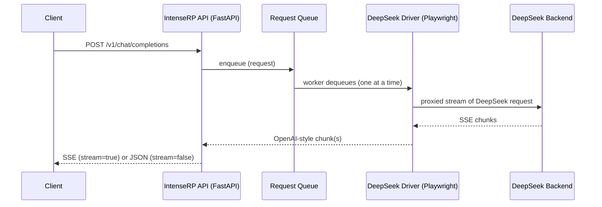

# :material-api: API Behavior

This page documents how the built-in OpenAI-compatible API behaves at runtime: what routes exist, how streaming works, and why requests are queued instead of running in parallel.

!!! note "Implementation detail"
    This is based on the current FastAPI + driver implementation (`api.py`, `deepseek_driver.py`, `main.py`). If DeepSeek changes their web app, behavior may need to change as well.

---

## :material-routes: Routes

IntenseRP currently exposes two OpenAI-style endpoints:

| Endpoint | Method | Purpose |
|---|---:|---|
| `/v1/models` | GET | List available model IDs |
| `/v1/chat/completions` | POST | Generate a chat completion (streaming or non-streaming) |

If **API Keys** are enabled, both routes require:

```
Authorization: Bearer YOUR_KEY
```

---

## :material-robot: Models and what they mean

The API reports three "models". They are *behavior presets* that map to DeepSeek UI toggles:

| Model ID | DeepThink | Send DeepThink |
|---|---|---|
| `deepseek-auto` | Uses your settings | Uses your settings |
| `deepseek-chat` | Forced off | Forced off |
| `deepseek-reasoner` | Forced on | Uses your settings |

!!! info "Where the toggles come from"
    DeepThink and Search are applied by clicking the DeepSeek web UI toggles right before sending. "Send DeepThink" controls whether the `<think>...</think>` content is included in the API output.

---

## :material-arrow-decision-outline: Request flow (high level)

At a high level, a request goes through these layers:

1. Client calls `POST /v1/chat/completions`
2. IntenseRP enqueues the request (FIFO)
3. A single worker dequeues one request at a time
4. The driver formats messages, drives the DeepSeek UI, and intercepts DeepSeek's network stream
5. IntenseRP forwards the stream to the client (or accumulates it and returns a single JSON response)



---

## :material-lan-pending: Concurrency and queueing

IntenseRP processes **one generation at a time**.

- Incoming requests are put into an internal queue.
- A single worker pulls from that queue and calls the driver.
- Requests are handled in order (first in, first out).

!!! tip "Why no parallel requests?"
    The current provider implementation drives a single live browser session and installs network interception on that page. Running multiple generations in parallel would conflict with UI state and interception handlers, so requests are serialized on purpose.

What this means in practice:

- If multiple clients send requests at once, later requests will wait.
- If your client retries aggressively, you may unintentionally build up a queue.

---

## :material-signal: Streaming (`stream: true`)

When you set `stream: true`, the API responds with `Content-Type: text/event-stream` and yields OpenAI-style SSE `data:` frames:

```json
{
  "id": "chatcmpl-custom",
  "object": "chat.completion.chunk",
  "created": 1730000000,
  "model": "deepseek-auto",
  "choices": [
    { "index": 0, "delta": { "content": "Hello" }, "finish_reason": null }
  ]
}
```

The stream ends with:

```
data: [DONE]
```

### Disconnect behavior

If a streaming client disconnects, IntenseRP will:

1. Mark the request as aborted
2. Stop forwarding chunks
3. Ask the driver to stop the generation in the DeepSeek UI

---

## :material-file-document: Non-streaming (`stream: false`)

When you set `stream: false`, the server still generates via streaming internally, but it accumulates all `delta.content` pieces into one final response:

- `choices[0].message.content` is the concatenated text
- `usage` is currently returned as zeros

!!! note "Compatibility fields"
    `temperature` and `top_p` are accepted for OpenAI compatibility, but the current DeepSeek driver does not apply them yet.

---

## :material-alert-circle: Errors and status codes

Common status codes:

| Code | When it happens |
|---:|---|
| 401 | API keys enabled and key is missing/invalid |
| 422 | Request JSON doesn't match the expected schema |
| 503 | Driver is not running (for example, browser not started) |

For debugging, the fastest path is usually:

- Enable the console and/or logfiles
- Reproduce once
- Inspect the last warnings/errors

[:material-console: Console & Logging](../features/console-logging.md)

---

## :material-arrow-right: Related pages

<div class="grid cards" markdown>

-   :material-lan: **Network & API**

    Ports, LAN access, and API key auth.

    [:arrow_right: Network & API](../features/network-api.md)

-   :material-cloud: **Provider Support**

    Provider roadmap and lifecycle stages.

    [:arrow_right: Provider Support](provider-support.md)

-   :material-bug: **Troubleshooting**

    Common fixes and bug report checklist.

    [:arrow_right: Troubleshooting](../hands/troubleshooting.md)

-   :material-console: **Console & Logging**

    How to capture and share logs safely.

    [:arrow_right: Console & Logging](../features/console-logging.md)

</div>

---

## :material-arrow-left: Back to Advanced

[:material-arrow-left: Advanced](../advanced.md)
