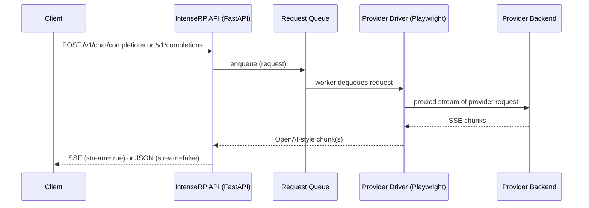

# :material-api: API Behavior

This page documents how the built-in OpenAI-compatible API behaves at runtime: what routes exist, how streaming works, and why requests are queued instead of running in parallel.

!!! note "Implementation detail"
    This is based on the current FastAPI + driver implementation (`api.py`, `deepseek_driver.py`, `glm_driver.py`, `moonshot_driver.py`, `qwen_driver.py`, `perplexity_driver.py`, `huggingchat_driver.py`, `aistudio_driver.py`, `mimo_driver.py`, `main.py`). If a provider changes their web app, behavior may need to change as well.

---

## :material-routes: Routes

IntenseRP currently exposes three OpenAI-style endpoints:

| Endpoint | Method | Purpose |
|---|---:|---|
| `/v1/models` | GET | List available model IDs |
| `/v1/chat/completions` | POST | Generate a chat completion (streaming or non-streaming) |
| `/v1/completions` | POST | Generate a legacy text completion from a raw prompt |

If **API Keys** are enabled, both routes require:

```
Authorization: Bearer YOUR_KEY
```

---

## :material-flask: Dry Run Mode

**Settings -> API Server -> Dry Run -> Dry Run Mode** starts the API server without launching a provider browser. The display window opens immediately and waits for an incoming request.

When a chat or text completion request arrives, IntenseRP captures the raw JSON body, renders the formatted prompt through the same formatting pipeline used for real provider sends, updates the display, and returns HTTP `418 I'm a teapot`. No request is queued and no provider page is touched.

Dry Run Mode applies only when services start. If a browser is already running, stop services and start again with Dry Run Mode enabled.

All parallel runtime paths are bypassed in this mode, meaning you can't submit multiple requests simultaneously, and each new captured request simply replaces the previous one in the display.

---

## :material-robot: Models and what they mean

The API reports provider-specific "model" IDs, but they are best thought of as **behavior presets**.

In normal single-provider mode, `GET /v1/models` follows the currently selected provider by default.

If **Settings -> API Server -> Model IDs -> Use Universal Model Names** is enabled, single-provider mode shows these instead:

| Model ID | Behavior |
|---|---|
| `intenserp-auto` | Uses your current provider settings |
| `intenserp-reasoner` | Forces thinking/reasoning on |
| `intenserp-chat` | Forces thinking/reasoning off |

Provider-prefixed behavior IDs still continue to work either way. **Providers in Parallel** still rejects `intenserp-*`, but it can expose UMM real-model IDs when this setting is enabled.

For GLM Chat, Google AI Studio, QwenLM, Perplexity, HuggingChat, and Xiaomi MiMo, Universal Model Names also exposes real model IDs in `/v1/models`. They are lowercase, with spaces and dots converted to `-`, and they keep the normal `-auto`, `-reasoner`, and `-chat` suffixes. For example, **GLM-5.1** appears as `glm-5-1-auto`, `glm-5-1-reasoner`, and `glm-5-1-chat`.

In Providers in Parallel, only conflicting real-model IDs get provider prefixes so they can route to the right browser. For example, Google AI Studio's **Gemini 3.1 Pro** can appear as `aistudio-gemini-3-1-pro-reasoner` if another active provider also exposes `gemini-3-1-pro-reasoner`.

The `intenserp-*` IDs use the model selected in Settings. A real-model ID overrides the provider's UI model for that request, then applies the suffix behavior on top.

### DeepSeek

These map to DeepSeek UI toggles:

| Model ID | DeepThink | Send DeepThink |
|---|---|---|
| `deepseek-auto` | Uses your settings | Uses your settings |
| `deepseek-chat` | Forced off | Forced off |
| `deepseek-reasoner` | Forced on | Uses your settings |

### GLM Chat

These map to GLM UI toggles:

| Model ID | Deep Think | Send Deep Think |
|---|---|---|
| `glm-auto` | Uses your settings | Uses your settings |
| `glm-chat` | Forced off | Forced off |
| `glm-reasoner` | Forced on | Uses your settings |

### Moonshot

Moonshot model IDs are behavior presets:

| Model ID | Thinking | Send Thinking |
|---|---|---|
| `moonshot-auto` | Uses your settings | Uses your settings |
| `moonshot-chat` | Forced off | Forced off |
| `moonshot-reasoner` | Forced on | Uses your settings |

### QwenLM

QwenLM model IDs are behavior presets:

| Model ID | Thinking | Send Thinking |
|---|---|---|
| `qwen-auto` | Uses your settings | Uses your settings |
| `qwen-chat` | Forced off | Forced off |
| `qwen-reasoner` | Forced on | Uses your settings |

### Perplexity

Perplexity model IDs are behavior presets:

| Model ID | Thinking | Send Thinking |
|---|---|---|
| `perplexity-auto` | Uses your settings | No thinking traces forwarded yet |
| `perplexity-chat` | Forced off | Forced off |
| `perplexity-reasoner` | Forced on when available | No thinking traces forwarded yet |

### HuggingChat

HuggingChat model IDs are behavior presets:

| Model ID | Thinking Effort | Send Thinking |
|---|---|---|
| `huggingchat-auto` | Uses your settings | Uses your settings |
| `huggingchat-chat` | Uses HuggingChat's default/off behavior | Forced off |
| `huggingchat-reasoner` | Uses your configured Thinking Effort | Uses your settings |

HuggingChat can also accept HuggingChat-only request fields such as `inference_provider`, `huggingchat_inference_provider`, and `huggingchat_thinking_effort`.

### Google AI Studio

Google AI Studio model IDs are also behavior presets:

!!! warning "Keep Humanize Mouse Movements enabled"
    AI Studio model IDs are exposed normally again. For reliable sends, leave **Settings -> Provider Behavior -> Google AI Studio -> Humanize Mouse Movements** enabled; it slows UI actions down, but avoids the too-fast interaction pattern that was breaking Google AI Studio.

| Model ID | Thinking Level | Send Thinking |
|---|---|---|
| `aistudio-auto` | Uses your settings | Uses your settings |
| `aistudio-chat` | Lowers Thinking Level on supported AI Studio models | Forced off |
| `aistudio-reasoner` | Uses your configured Thinking Level | Uses your settings |

### Xiaomi MiMo

MiMo model IDs are behavior presets:

| Model ID | Thinking Output | Send Thinking |
|---|---|---|
| `mimo-auto` | MiMo decides internally | Uses your settings |
| `mimo-chat` | MiMo decides internally | Forced off |
| `mimo-reasoner` | MiMo decides internally | Forced on |

MiMo's web UI does not expose a thinking toggle; these modes control whether IntenseRP forwards or filters MiMo's streamed `<think>` text.

### Request `reasoning_effort`

If **Settings -> API Server -> Request Controls -> Accept API Reasoning Effort** is enabled (it is off by default), IntenseRP also accepts OpenAI-style per-request reasoning effort fields:

```json
{
  "model": "aistudio-auto",
  "reasoning_effort": "medium"
}
```

Nested `reasoning.effort` is accepted too, for clients that use that shape:

```json
{
  "model": "aistudio-auto",
  "reasoning": { "effort": "medium" }
}
```

Top-level `reasoning_effort` wins if both are present.

When this compatibility setting is enabled, **Reasoning Effort Providers** controls where it applies. For selected providers, the resolved effort takes priority over the reasoning part of the `model` ID for that request. Providers left unchecked ignore the request field and keep using the model ID suffix, Provider Behavior settings, or loadout values.

!!! tip "AI Studio and GLM-5.2 benefit most here"
     AI Studio has a built-in Thinking Level control, and GLM-5.2 has a Deep Think effort menu. For most other providers, the API effort is just a toggle that turns reasoning on or off based on the value sent.

For most providers, effort values are simplified into the existing reasoning toggle:

| Request effort | Effective behavior |
|---|---|
| Not sent, `auto`, `minimum`, `minimal`, `low` | Forces chat/off mode |
| `medium`, `high`, `max`, `xhigh`, and similar higher values | Forces reasoner/on mode |

For Google AI Studio, explicit efforts are mapped to Thinking Level instead: `minimum`/`minimal` -> `Minimal`, `low` -> `Low`, `medium` -> `Medium`, and `high`/`max`/`xhigh` -> `High`. If no effort is sent, IntenseRP still treats that as chat/off mode because clients like SillyTavern use "Auto" by omitting the field.

For GLM-5.2, enabled efforts also select the Deep Think effort menu: `medium`/`high` -> `High`, and `max`/`xhigh` -> `Max`. Disabled and low-effort values still force Deep Think off.

!!! note "AI Studio rounding"
    AI Studio models don't expose the same controls. IntenseRP may round to the closest available Thinking Level. The old Gemini 2.5 manual thinking-budget mappings are still kept in the driver, but requests that resolve to Gemini 2.5 are rejected because those models have become paid in AI Studio.

!!! info "What these IDs are (and are not)"
    Provider-prefixed and `intenserp-*` IDs are behavior presets. IntenseRP uses them to decide which provider UI toggles to click before sending.

    For providers with a real web UI model picker (GLM Chat, QwenLM, Perplexity, HuggingChat, Google AI Studio, Xiaomi MiMo), the extra real-model IDs can override the **Provider Behavior** model for a single request.

!!! note "AI Studio anti-censorship retries"
    When **Settings -> Provider Behavior -> Google AI Studio -> Anti-Censorship** is enabled, IntenseRP may temporarily hold a blocked AI Studio attempt, edit the blocked turn in the web UI, and send up to 3 continue nudges. Once a retry starts producing real assistant text, that recovered attempt streams normally again.

    If **CAARS** is enabled, AI Studio first runs a hidden savior-model prelude in the browser, edits that turn, then streams only the main model's continuation back to the API.

---

## :material-arrow-decision-outline: Request flow (high level)

At a high level, a request goes through these layers:

1. Client calls `POST /v1/chat/completions` or `POST /v1/completions`
2. IntenseRP enqueues the request (FIFO)
3. A queue worker dequeues the request
4. The driver either formats chat messages or forwards a raw text-completion prompt, then drives the selected provider UI and intercepts its network stream
5. IntenseRP forwards the stream to the client (or accumulates it and returns a single JSON response)



---

## :material-lan-pending: Concurrency and queueing

By default, IntenseRP processes **one generation at a time**.

- Incoming requests are put into an internal queue.
- A single worker pulls from that queue and calls the driver.
- Requests are handled in order (first in, first out).

!!! tip "Why no parallel requests?"
    The current provider implementation drives a single live browser session and installs network interception on that page. Running multiple generations in parallel would conflict with UI state and interception handlers, so requests are serialized on purpose.

!!! note "Providers in Parallel"
    **Browser & Runtime -> Providers in Parallel** can add more browser lanes and allow queued API work to overlap. Those modes are heavier than the normal single-provider queue, so use them when the extra throughput is worth the extra browser weight.

What this means in practice:

- If multiple clients send requests at once, later requests will wait.
- If your client retries aggressively, you may unintentionally build up a queue.

## :material-format-list-bulleted: Request Queue Preview (UI) { #request-queue-preview }

If you want to see the queue without guessing (or digging through logs), IntenseRP can show an optional panel in the main window.

:material-arrow-right: **Settings** → **Interface** → **Main Window** → **Show the Request Queue Panel**

Once enabled, it shows the request currently being processed (if any), plus any waiting requests.

Each entry includes a short request ID (useful when matching things up with logs), when it was added, request type, message count or prompt length, model, streaming mode, and the API key name (if you have API keys enabled).

You can drag the divider to resize it if you don't like the default width.

At the bottom of the panel, there are 2 queue controls:

- **Stop** (square) - aborts the currently active request and disconnects the client
- **Clear Queue** (trash) - cancels all queued requests after the current one

---

## :material-signal: Streaming (`stream: true`)

When you set `stream: true`, the API responds with `Content-Type: text/event-stream` and yields OpenAI-style SSE `data:` frames:

```json
{
  "id": "chatcmpl-custom",
  "object": "chat.completion.chunk",
  "created": 1730000000,
  "model": "deepseek-auto",
  "choices": [
    { "index": 0, "delta": { "content": "Hello" }, "finish_reason": null }
  ]
}
```

The stream ends with:

```
data: [DONE]
```

!!! note "Usage in streams"
    For GLM Chat, QwenLM, and Xiaomi MiMo, if **Count Tokens** is enabled in the provider Behavior settings, IntenseRP emits one extra final chunk with `usage` (and `choices: []`) right before `data: [DONE]`.

### Text completions stream shape

For `POST /v1/completions`, IntenseRP still streams over SSE, but the payload uses the legacy completions shape:

```json
{
  "id": "cmpl-custom",
  "object": "text_completion",
  "created": 1730000000,
  "model": "deepseek-auto",
  "choices": [
    { "text": "Hello", "index": 0, "logprobs": null, "finish_reason": null }
  ]
}
```

### Disconnect behavior

If a streaming client disconnects, IntenseRP will:

1. Mark the request as aborted
2. Stop forwarding chunks
3. Ask the driver to stop the generation in the active provider UI

---

## :material-file-document: Non-streaming (`stream: false`)

When you set `stream: false`, the server still generates via streaming internally, but it accumulates all `delta.content` pieces into one final response:

- `choices[0].message.content` is the concatenated text
- `usage` GLM Chat, QwenLM, and Xiaomi MiMo can populate it when **Count Tokens** is enabled in the provider Behavior settings

!!! note "Compatibility fields"
    `temperature`, `top_p`, `max_tokens`, and `reasoning_effort` are accepted for OpenAI compatibility.

    Right now, Google AI Studio is the only provider that actively applies `temperature`, `top_p`, and `max_tokens` in the web UI, when the selected model exposes those controls. `reasoning_effort` is handled by the API layer before the request reaches a selected provider.

---

## :material-code-string: Text Completions (`POST /v1/completions`)

This route is the old prompt-based API shape. Instead of sending a chat transcript, you send one raw `prompt`, and IntenseRP forwards that prompt as-is after stripping recognized macros.

Right now, IntenseRP supports one prompt per request on this route. If a client sends multiple prompts in one `/v1/completions` call, the request is rejected instead of trying to fan out multiple browser generations at once.

That means the usual chat-only formatting layers are skipped here on purpose:

- No chat templates
- No injection block
- No name scanning / name substitution
- No system-message splitting tricks

On Google AI Studio specifically, this also means IntenseRP will not try to use the separate **System Instructions** field for text completions, even if you normally have that feature enabled for chat requests.

!!! warning "Macros"
    Macros still work, but they are resolved directly from the raw prompt text. If the same prompt contains conflicting macros, the latest occurrence wins. In practice that makes them behave more like inline toggles while the prompt is being read top-to-bottom.

---

## :material-alert-circle: Errors and status codes

Common status codes:

| Code | When it happens |
|---:|---|
| 401 | API keys enabled and key is missing/invalid |
| 422 | Request JSON doesn't match the expected schema |
| 503 | Driver is not running (for example, browser not started) |

For debugging, the fastest path is usually:

- Enable the console and/or logfiles
- Reproduce once
- Inspect the last warnings/errors

[:material-console: Console & Logging](../features/console-logging.md)

---

## :material-arrow-right: Related pages

<div class="grid cards" markdown>

-   :material-lan: **Network & API**

    Ports, LAN access, and API key auth.

    [:arrow_right: Network & API](../features/network-api.md)

-   :material-cloud: **Provider Support**

    Provider roadmap and lifecycle stages.

    [:arrow_right: Provider Support](provider-support.md)

-   :material-bug: **Troubleshooting**

    Common fixes and bug report checklist.

    [:arrow_right: Troubleshooting](../hands/troubleshooting.md)

-   :material-console: **Console & Logging**

    How to capture and share logs safely.

    [:arrow_right: Console & Logging](../features/console-logging.md)

</div>

---

## :material-arrow-left: Back to Advanced

[:material-arrow-left: Advanced](../advanced.md)
