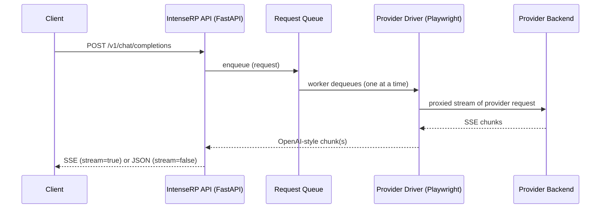

# :material-api: API Behavior

This page documents how the built-in OpenAI-compatible API behaves at runtime: what routes exist, how streaming works, and why requests are queued instead of running in parallel.

!!! note "Implementation detail"
    This is based on the current FastAPI + driver implementation (`api.py`, `deepseek_driver.py`, `glm_driver.py`, `moonshot_driver.py`, `qwen_driver.py`, `main.py`). If a provider changes their web app, behavior may need to change as well.

---

## :material-routes: Routes

IntenseRP currently exposes two OpenAI-style endpoints:

| Endpoint | Method | Purpose |
|---|---:|---|
| `/v1/models` | GET | List available model IDs |
| `/v1/chat/completions` | POST | Generate a chat completion (streaming or non-streaming) |

If **API Keys** are enabled, both routes require:

```
Authorization: Bearer YOUR_KEY
```

---

## :material-robot: Models and what they mean

The API reports provider-specific "model" IDs, but they are best thought of as **behavior presets**.

Which IDs you get from `GET /v1/models` depends on the currently selected provider in **Settings -> Providers & Credentials**.

### DeepSeek

These map to DeepSeek UI toggles:

| Model ID | DeepThink | Send DeepThink |
|---|---|---|
| `deepseek-auto` | Uses your settings | Uses your settings |
| `deepseek-chat` | Forced off | Forced off |
| `deepseek-reasoner` | Forced on | Uses your settings |

### GLM Chat

These map to GLM UI toggles:

| Model ID | Deep Think | Send Deep Think |
|---|---|---|
| `glm-auto` | Uses your settings | Uses your settings |
| `glm-chat` | Forced off | Forced off |
| `glm-reasoner` | Forced on | Uses your settings |

### Moonshot

Moonshot model IDs are behavior presets:

| Model ID | Thinking | Send Thinking |
|---|---|---|
| `moonshot-auto` | Uses your settings | Uses your settings |
| `moonshot-chat` | Forced off | Forced off |
| `moonshot-reasoner` | Forced on | Uses your settings |

### QwenLM

QwenLM model IDs are behavior presets:

| Model ID | Thinking | Send Thinking |
|---|---|---|
| `qwen-auto` | Uses your settings | Uses your settings |
| `qwen-chat` | Forced off | Forced off |
| `qwen-reasoner` | Forced on | Uses your settings |

!!! info "What these IDs are (and are not)"
    These IDs are not true model selection. IntenseRP uses them to decide which provider UI toggles to click before sending.

    For GLM specifically, the *real* GLM model is selected via **Settings -> GLM Behavior -> Model** (GLM-5 / GLM-4.7 / GLM-4.6). The API `glm-*` IDs still remain behavior presets.

---

## :material-arrow-decision-outline: Request flow (high level)

At a high level, a request goes through these layers:

1. Client calls `POST /v1/chat/completions`
2. IntenseRP enqueues the request (FIFO)
3. A single worker dequeues one request at a time
4. The driver formats messages, drives the selected provider UI, and intercepts its network stream
5. IntenseRP forwards the stream to the client (or accumulates it and returns a single JSON response)



---

## :material-lan-pending: Concurrency and queueing

IntenseRP processes **one generation at a time**.

- Incoming requests are put into an internal queue.
- A single worker pulls from that queue and calls the driver.
- Requests are handled in order (first in, first out).

!!! tip "Why no parallel requests?"
    The current provider implementation drives a single live browser session and installs network interception on that page. Running multiple generations in parallel would conflict with UI state and interception handlers, so requests are serialized on purpose.

What this means in practice:

- If multiple clients send requests at once, later requests will wait.
- If your client retries aggressively, you may unintentionally build up a queue.

## :material-format-list-bulleted: Request Queue Preview (UI) { #request-queue-preview }

If you want to see the queue without guessing (or digging through logs), IntenseRP can show an optional panel in the main window.

:material-arrow-right: **Settings** → **System Settings** → **Main Window** → **Request Queue Preview**

Once enabled, it shows the request currently being processed (if any), plus any waiting requests.

Each entry includes a short request ID (useful when matching things up with logs), when it was added, message count, model, streaming mode, and the API key name (if you have API keys enabled).

You can drag the divider to resize it if you don't like the default width.

At the bottom of the panel, there are 2 queue controls:

- **Stop** (square) - aborts the currently active request and disconnects the client
- **Clear Queue** (trash) - cancels all queued requests after the current one

---

## :material-signal: Streaming (`stream: true`)

When you set `stream: true`, the API responds with `Content-Type: text/event-stream` and yields OpenAI-style SSE `data:` frames:

```json
{
  "id": "chatcmpl-custom",
  "object": "chat.completion.chunk",
  "created": 1730000000,
  "model": "deepseek-auto",
  "choices": [
    { "index": 0, "delta": { "content": "Hello" }, "finish_reason": null }
  ]
}
```

The stream ends with:

```
data: [DONE]
```

!!! note "Usage in streams"
    For GLM Chat and QwenLM, if **Count Tokens** is enabled in the provider Behavior settings, IntenseRP emits one extra final chunk with `usage` (and `choices: []`) right before `data: [DONE]`.

### Disconnect behavior

If a streaming client disconnects, IntenseRP will:

1. Mark the request as aborted
2. Stop forwarding chunks
3. Ask the driver to stop the generation in the active provider UI

---

## :material-file-document: Non-streaming (`stream: false`)

When you set `stream: false`, the server still generates via streaming internally, but it accumulates all `delta.content` pieces into one final response:

- `choices[0].message.content` is the concatenated text
- `usage` GLM Chat and QwenLM can populate it when **Count Tokens** is enabled in the provider Behavior settings

!!! note "Compatibility fields"
    `temperature` and `top_p` are accepted for OpenAI compatibility, but current provider drivers do not apply them yet.

---

## :material-alert-circle: Errors and status codes

Common status codes:

| Code | When it happens |
|---:|---|
| 401 | API keys enabled and key is missing/invalid |
| 422 | Request JSON doesn't match the expected schema |
| 503 | Driver is not running (for example, browser not started) |

For debugging, the fastest path is usually:

- Enable the console and/or logfiles
- Reproduce once
- Inspect the last warnings/errors

[:material-console: Console & Logging](../features/console-logging.md)

---

## :material-arrow-right: Related pages

<div class="grid cards" markdown>

-   :material-lan: **Network & API**

    Ports, LAN access, and API key auth.

    [:arrow_right: Network & API](../features/network-api.md)

-   :material-cloud: **Provider Support**

    Provider roadmap and lifecycle stages.

    [:arrow_right: Provider Support](provider-support.md)

-   :material-bug: **Troubleshooting**

    Common fixes and bug report checklist.

    [:arrow_right: Troubleshooting](../hands/troubleshooting.md)

-   :material-console: **Console & Logging**

    How to capture and share logs safely.

    [:arrow_right: Console & Logging](../features/console-logging.md)

</div>

---

## :material-arrow-left: Back to Advanced

[:material-arrow-left: Advanced](../advanced.md)
