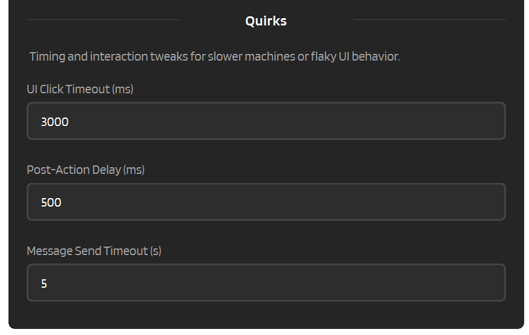

# :material-wrench-clock: GLM Quirks

GLM Chat (chat.z.ai) works well as a provider, but it has a few quirks you should know about. This page goes deeper into the timing settings, known issues, and workarounds that can make your experience smoother.

For the main GLM settings and behavior toggles, see [:material-chat-processing: GLM Behavior](../providers/glm-behavior.md).

---

## :material-timer-sand: Timeout & Timing Settings

GLM's web UI can be a bit sluggish sometimes, especially on slower machines or unstable connections. IntenseRP exposes a few timing knobs under **Provider Behavior** so you can tune things to your setup.

:material-arrow-right: **Settings** -> **Provider Behavior** -> **GLM Chat** -> **Quirks**

### UI Click Timeout

How long (in milliseconds) IntenseRP waits for a UI element (button, dropdown, toggle) to become clickable before giving up.

| | |
|---|---|
| **Setting** | UI Click Timeout (ms) |
| **Default** | 3000 ms (3 seconds) |
| **Minimum** | 500 ms |

If you're seeing timeout errors when IntenseRP tries to toggle Deep Think or switch models, try bumping this up to 5000 or even 8000. Slow machines, high CPU load, or a busy browser can all cause elements to take longer to appear.

### Post-Action Delay

A small pause (in milliseconds) that IntenseRP inserts after UI actions like opening a new chat or switching models. This gives the GLM interface a moment to settle before IntenseRP tries to do the next thing.

| | |
|---|---|
| **Setting** | Post-Action Delay (ms) |
| **Default** | 500 ms |
| **Minimum** | 0 ms |

If you notice IntenseRP clicking things "too fast" for the UI to keep up (actions getting swallowed or ignored), raise this. On very fast machines you can lower it for snappier response times.

### Message Send Timeout

How long (in seconds) IntenseRP waits for the send button to become active after typing or pasting your message into the text box. This is **not** the file upload timeout - that one lives under [:material-file-upload: File Upload Mode](../providers/glm-behavior.md#file-upload-mode).

| | |
|---|---|
| **Setting** | Message Send Timeout (s) |
| **Default** | 5 seconds |
| **Minimum** | 1 second |

GLM occasionally takes a moment to "process" the pasted text before the send button lights up. If you're getting send-timeout errors, try raising this to 10 or 15.

### Completion Request Timeout

How long (in seconds) IntenseRP waits after clicking **Send** or **Regenerate** for GLM's completion request to actually appear on the network.

| | |
|---|---|
| **Setting** | Completion Request Timeout (s) |
| **Default** | 150 seconds |
| **Minimum** | 5 seconds |

This covers the "completion request was not observed" case. GLM can sometimes flip the UI into a sending state before the backend request shows up, so this timeout is intentionally much longer than the normal send-button timeout.

### First Chunk Timeout

How long (in seconds) IntenseRP waits for GLM's response stream to actually begin after the request has already been sent.

| | |
|---|---|
| **Setting** | First Chunk Timeout (s) |
| **Default** | 45 seconds |
| **Minimum** | 5 seconds |

This is handy for the exact annoying case where GLM accepted the request, but the first visible response data takes a while to show up. Slow machines, overloaded browsers, or GLM servers being hammered can all make this happen.

If you're seeing "timed out waiting for intercepted first chunk" errors, try bumping this up to 60 or 90.

### Refresh After Generation

If enabled, IntenseRP waits 2 seconds after GLM finishes a response, then refreshes (reloads) the GLM Chat page.

This can sometimes restore GLM's front-end state and make Reuse Matching Chat less flaky.

| | |
|---|---|
| **Setting** | Refresh After Generation |
| **Default** | Off |
| **Delay** | 2 seconds (fixed) |

!!! warning "Tradeoff"
    This reloads the GLM page after every request, which can feel slower and may briefly flicker the UI.

---

## :material-file-upload: File Upload Timeout (recap)

This is actually a separate setting from the quirks trio above, but it's worth mentioning here since it's also timing-related.

When **Send As Text File** is enabled, IntenseRP uploads your prompt as a `.txt` file. GLM needs a moment to process the upload before the send button is active.

:material-arrow-right: **Settings** -> **Provider Behavior** -> **GLM Chat** -> **File Upload Timeout**

| | |
|---|---|
| **Default** | 15 seconds |

If you're on a slow connection or uploading very large prompts, raise this. If uploads keep timing out even at high values, check your network connection.

---

## :material-shield-lock: CAPTCHA on Login

GLM's login flow includes a CAPTCHA that IntenseRP **cannot** solve automatically. Even if you have Auto Login enabled and your credentials saved, you'll still need to complete the CAPTCHA manually in the browser window.

### What to do

1. Start the browser from IntenseRP
2. Wait for the login page to load
3. Complete the CAPTCHA in the Chromium window
4. IntenseRP handles the rest (filling credentials, clicking submit)

### Avoiding the CAPTCHA altogether

Enable **Persistent Sessions**. Once you've logged in and the session is saved, IntenseRP reuses that session on future starts so that there are no more logins and thus no more CAPTCHAs.

:material-arrow-right: **Settings** -> **Provider and Login** -> **Saved Sessions** -> **Keep Provider Sessions Signed In**

!!! tip "Strongly recommended for GLM"
    Persistent Sessions are the single best quality-of-life improvement for GLM users. The CAPTCHA is annoying, and skipping it entirely makes the experience much smoother.

See: [:material-key: Login & Sessions](../features/login-sessions.md)

---

## :material-refresh: Reuse Matching Chat Instability

Reuse Matching Chat (reusing the same chat when you send an identical prompt) is **unreliable** with GLM Chat. The "Regenerate" action sometimes errors out even though GLM actually processes the request normally. In 99.9% of cases it will not even appear at all.

If you want to experiment with it anyway, try enabling **Refresh After Generation** under **Settings -> Provider Behavior -> GLM Chat -> Quirks**. This reloads the page after every response and can sometimes restore the UI state so Regenerate becomes available again.

If your main goal is not "reuse the same chat" but more like "please stop acting weird on duplicate prompts", GLM also has **Repetition Buster**. That is the opposite strategy: IntenseRP sends a random 128-character throwaway prompt in a fresh chat, then opens another fresh chat for the real request.

That means it creates extra chats on purpose, but it also avoids depending on GLM's flaky **Regenerate** button.

---

## :material-translate: UI Language Requirement

The GLM driver expects the web UI to be in **English (en-US)**. If GLM's interface is set to Chinese or another language, IntenseRP may fail to locate buttons, toggles, and selectors.

### How to fix

1. Open the GLM browser window (it appears when you click Start)
2. Find the language setting in GLM's UI
3. Switch to **English (en-US)**
4. Refresh the page (F5 / Ctrl+R)
5. Restart from IntenseRP if needed

!!! info "IntenseRP checks for you"
    IntenseRP performs a language check on startup. If it detects a non-English GLM interface, it'll show a warning dialog and let you decide whether to continue or stop.

---

## :material-format-list-bulleted: Model Fallback Behavior

IntenseRP lets you pick which GLM model to use (GLM-5.1, GLM-5-Turbo, GLM-5V-Turbo, GLM-5, GLM-4.7) via **Settings -> Provider Behavior -> GLM Chat -> Model**.

But GLM's web UI doesn't always have every model available. Models come and go depending on rollouts, A/B testing, or maintenance. If IntenseRP can't find your selected model in the dropdown:

1. It logs a warning ("Selected model not found, falling back...")
2. It selects the **first available model** in the dropdown instead
3. Generation proceeds normally with the fallback model

This is a silent fallback that will just log a message (warning). Keep an eye on the Activity Log or Console if you suspect your model selection isn't being honored.

---

## :material-text-box-outline: Text File Filler

GLM won't let you send a file attachment with a completely empty text box. It requires *some* text alongside the upload. By default, IntenseRP pastes a single `.` (dot) as filler, but you can change this to anything you want.

:material-arrow-right: **Settings** -> **Provider Behavior** -> **GLM Chat** -> **Text File Filler**

This is a minor quirk, but worth knowing about if you notice a stray dot in your GLM chat history when using File Upload mode.

!!! info "Same for Kimi"
    Kimi also requires text alongside file uploads, so this setting applies to both GLM and Kimi providers (though each provider has its own separate filler text in case you want different ones).

---

## :material-format-list-checks: Quick Reference

| Quirk | Impact | Fix / Workaround |
|---|---|---|
| **CAPTCHA on login** | Must solve manually | Use Persistent Sessions |
| **UI language must be English** | Buttons not found | Change GLM UI to en-US |
| **Reuse Matching Chat unreliable** | Spurious errors | Use Repetition Buster, disable Reuse Matching Chat, or try Refresh After Generation |
| **Model not in dropdown** | Silent fallback | Check logs, update IntenseRP |
| **Slow UI clicks** | Timeout errors | Increase UI Click Timeout |
| **Send button delayed** | Send timeout | Increase Message Send Timeout |
| **Slow response start** | First chunk timeout | Increase First Chunk Timeout |
| **File upload stalls** | Upload timeout | Increase File Upload Timeout |
| **Text box can't be empty** | Upload fails | Keep Text File Filler set |

---

## :material-arrow-left: Back to Advanced

[:material-arrow-left: Advanced](../advanced.md)
