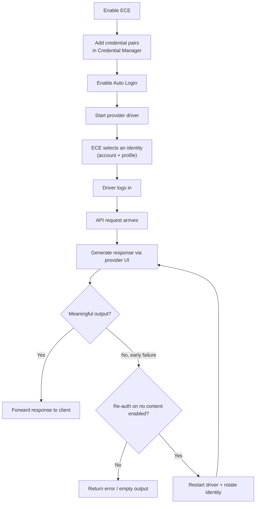
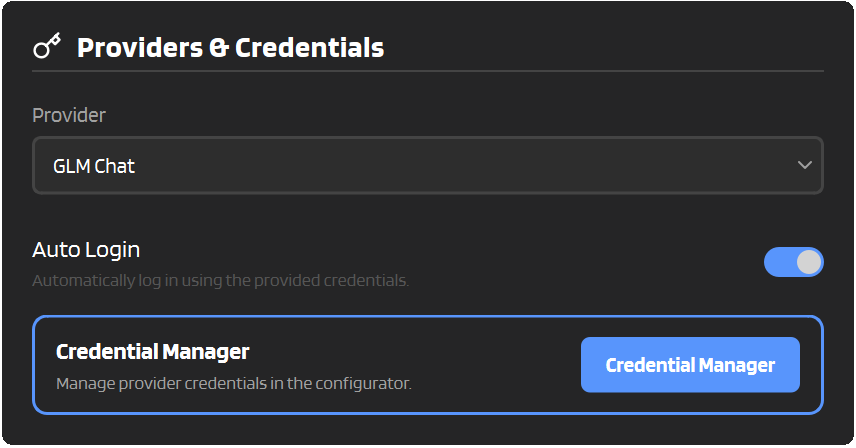

# :material-key: Experimental Credential Engine (ECE)

ECE (Experimental Credential Engine) is an opt-in alternative to the legacy "one email/password per provider" setup.

Instead of storing a single provider login in Settings, ECE lets you store **multiple credential pairs per provider**, pick which one is used on start, and (optionally) **retry a failed request by restarting the browser and rotating to a different identity**.

It's mainly meant for two things:

1. Making it easier to manage multiple accounts (and their sessions) in one place.
2. Improving reliability when a provider fails early (for example due to rate limits) by rotating to a different account or browser profile.

---

## :material-information: HIGHLY RECOMMENDED

1. Enable **Auto Login** in Settings -> Providers & Credentials (required for ECE to pick a stored pair).
2. Use **Persistent Sessions** (Settings -> System Settings) so you don't have to log in every time.
3. Keep a backup of your `[config_dir]` (Settings -> System -> Backup & Restore) in case something goes wrong.
4. Enable **both** of the ECE experimental settings:
    - **Select Least Used**: spreads usage across accounts
    - **Re-auth on no content**: retries failed requests with a rotated identity

!!! warning "Why these?"
    ECE is still experimental, and these features dramatically improve usability and reliability. Most of the benefits of ECE come from using them together.

---

## :material-lightbulb: The big picture



If you're using ECE, you will mostly interact with it through the Settings UI. Under the hood, ECE is used by the drivers at login time, and by the API worker when it decides whether to retry a failed request.

---

## :material-play-circle: Quick setup

1. Open **Settings**.
2. Go to **Experimental** and enable **Enable Experimental Credential Engine (ECE)**.
3. Go to **Providers & Credentials** and enable **Auto Login**.
4. In the same category, open **Credential Manager** and add one or more credential pairs for your provider.
5. Click **Save**, then **Stop -> Start** the provider driver (so the new settings take effect).



!!! warning "If you don't enable Auto Login"
    ECE will not pick a stored credential pair, and you'll log in manually like usual.

!!! note "First open migration from legacy fields"
    The first time you open **Credential Manager**, IntenseRP tries to copy legacy provider credentials (old DeepSeek / GLM / Moonshot email + password fields) into ECE as the first rows when possible.

    If any ECE credentials already exist, this import is skipped.

    Legacy values are not deleted from the old fields.

### Settings overview

| Setting | Where | What it does |
|---|---|---|
| **Enable Experimental Credential Engine (ECE)** | Settings -> Experimental | Turns on ECE and hides the legacy provider email/password fields |
| **Credential Manager** | Settings -> Providers & Credentials | Lets you add multiple credential pairs per provider |
| **Select Least Used** | Settings -> Experimental | Chooses the least recently used account when starting the driver |
| **Re-auth on no content** | Settings -> Experimental | On early failures, restarts the driver and retries once with a rotated identity |
| **Auto Login** | Settings -> Providers & Credentials | Required for ECE to select and use stored pairs (and for auto re-auth) |

---

## :material-account-switch: How ECE picks a credential pair

ECE stores credential pairs per provider (DeepSeek / GLM / Moonshot). On driver start, it selects a pair only when **Auto Login** is enabled.

There are two selection modes. If **Select Least Used** is disabled, ECE picks a random pair from the list. If **Select Least Used** is enabled, ECE prefers the account that was used the longest time ago, and accounts that have never been used yet are preferred first.

This is tracked in an internal "last used" map (stored alongside the encrypted credentials).

!!! tip "Want to force a specific account?"
    For now, ECE cannot pin a specific row. If you need a specific account, keep only that credential pair in Credential Manager (and remove the others temporarily).

---

## :material-cookie: Persistent Sessions with ECE

Persistent Sessions still works the same way (it stores a reusable browser profile), but when ECE is enabled the profile layout changes.

Without ECE, profiles live here:

```
[config_dir]/playwright_profiles/deepseek/
[config_dir]/playwright_profiles/glm_chat/
[config_dir]/playwright_profiles/moonshot_kimi/
```

With ECE enabled, profiles live under an ECE namespace, and each account gets its own folder:

```
[config_dir]/playwright_profiles/ece/deepseek/<hash>/
[config_dir]/playwright_profiles/ece/glm_chat/<hash>/
[config_dir]/playwright_profiles/ece/moonshot_kimi/<hash>/
```

The `<hash>` is derived from your email (SHA-256, truncated). It's only there so your email doesn't show up in folder names.

If ECE is enabled but no account is selected (for example Auto Login is off), the profile name falls back to:

```
[config_dir]/playwright_profiles/ece/<provider>/manual/
```

!!! note "Clear Profile deletes all ECE profiles for the provider"
    When ECE is enabled, **Clear Profile** removes `[config_dir]/playwright_profiles/ece/<provider>/` which logs you out of all ECE identities for that provider.

---

## :material-refresh: Re-auth on no content (auto retry)

This option is meant to handle cases where a provider fails early and returns no meaningful output (for example, a rate limit / quota style error).

When enabled, each request gets up to **two attempts**. If the first attempt produces no meaningful output, IntenseRP restarts the driver, rotates the ECE identity, and retries once.

To activate this behavior you must enable **ECE**, enable **Re-auth on no content**, and enable **Auto Login**.

!!! note "This restarts the browser"
    The retry is implemented by closing and restarting the provider driver, which means the provider browser window is relaunched. If you have the browser open for manual use, expect it to get interrupted.

It only retries when the failure happens before any real output is produced. If the provider already streamed meaningful text, IntenseRP prefers to keep that partial output instead of discarding it for a retry.

### What "rotate identity" means

ECE tries two strategies, in this order:

1. Switch to a different **account** (another credential pair), if you have more than one.
2. If there's only one account available, create a new **profile slot** for that same account (a fresh browser profile) and restart.

The second option is mostly useful when **Persistent Sessions** are enabled, because it forces a clean session/profile for the same login.

---

## :material-lock: Where ECE data is stored (and how secure it is)

ECE stores its data inside your config directory:

```
[config_dir]/ece/credentials.json.enc
[config_dir]/ece/usage.json.enc
```

These files are encrypted using the same `settings.key` used for your main settings file:

```
[config_dir]/settings.key
```

!!! note "Security reality check"
    This is encryption-at-rest for the config files, not a password manager. If someone has access to your config directory, they can usually access the key too. Treat `[config_dir]` as sensitive.

---

## :material-chat-alert: Provider notes

**DeepSeek:** if ECE is enabled but no DeepSeek credential pairs are configured, IntenseRP will simply wait for you to log in manually.

**GLM Chat:** ECE can fill email/password, but GLM still requires a CAPTCHA step. Persistent Sessions are strongly recommended so you don't have to repeat the CAPTCHA every start.

**Moonshot:** login is Google-based and may still require manual confirmation/challenges depending on your account security settings.

---

## :material-frequently-asked-questions: Quick FAQ

??? question "I enabled ECE, but I still see the old provider email/password fields"
    Make sure **Experimental -> Enable Experimental Credential Engine (ECE)** is on, then reopen Settings. When ECE is enabled, the legacy fields are hidden and a **Credential Manager** entry appears instead.

??? question "ECE is enabled, but nothing changes when I start the driver"
    ECE only selects a stored credential pair when **Auto Login** is enabled. If Auto Login is off, the driver will wait for manual login as usual.

??? question "How do I switch accounts?"
    Today it's automatic. Either:

    - Keep **Select Least Used** disabled to pick a random pair on start, or
    - Enable **Select Least Used** to spread usage across accounts, or
    - Enable **Re-auth on no content** so a failure can trigger an automatic rotation.

??? question "Can I see which account ECE picked?"
    Not in the UI yet, but you can usually tell from which browser profile stays logged in (when Persistent Sessions are enabled), and from log lines mentioning ECE.

??? question "Will ECE delete my old provider credential fields?"
    No. ECE does not delete legacy credential fields.

    On first open of **Credential Manager**, it may copy existing legacy credentials into ECE as first rows, but the legacy fields remain unchanged.

---

## :material-arrow-right: Related pages

[:material-key: Login & Sessions](../features/login-sessions.md)

[:material-cog: System (config dir, profiles, backups)](../features/system.md)

[:material-bug: Troubleshooting](../hands/troubleshooting.md)
