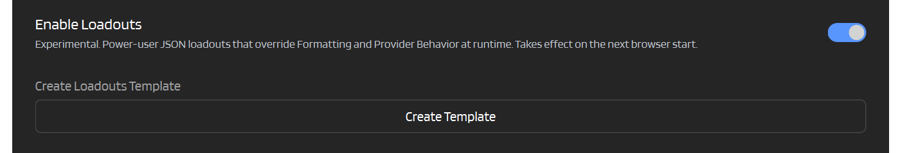
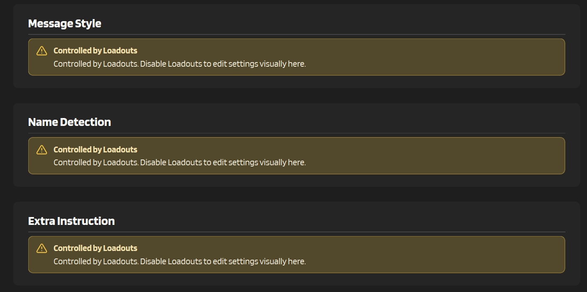
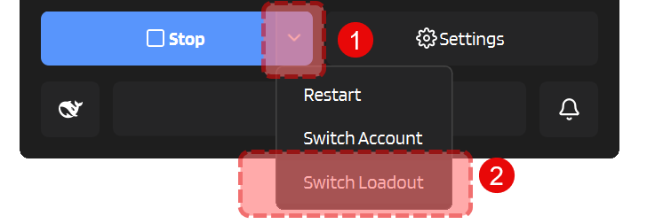

# :material-file-code-outline: Loadouts (Experimental)

Loadouts are a file-based override system for people who would rather edit a JSON file than click through the Settings UI every time.

When enabled, IntenseRP stops using the visual **Formatting** and **Provider Behavior** controls at runtime and reads those values from `loadouts.json` instead.

!!! warning "Experimental and intentionally technical"
    This feature is meant for power users.

    IntenseRP validates the file before startup. If the file is missing, malformed, or contains unsupported fields or values, startup is blocked until you fix it.

---

## :material-toggle-switch: Enable it

:material-arrow-right: **Settings** -> **Advanced** -> **Experimental Features** -> **Enable Loadouts**

When that toggle is on, a new **Create Template** button appears right below it.

That button writes `loadouts.json` into the **app root**:

- source checkout: next to `main.py`
- packaged build: next to the app executable

It is **not** stored under `config_data/`, and packaged updates keep that file in place.



---

## :material-file-document-edit-outline: Template file

The template is a JSON list. Each item is 1 loadout.

Every loadout contains:

- `Meta.Name`: the loadout name you will see in the switcher
- `Meta.Provider`: which provider the loadout belongs to
- `Meta._Comment`: optional helper text, ignored by IntenseRP
- formatting fields
- that provider's behavior fields

The generated template includes 1 example named `Template` for each provider, all filled with the normal app-default values.

```json
[
  {
    "Meta": {
      "Name": "Template",
      "Provider": "DeepSeek",
      "_Comment": "Valid providers: DeepSeek, GLM Chat, Moonshot, QwenLM, Google AI Studio"
    },
    "formatting_preset": "Classic - Name",
    "formatting_template": "{{name}}: {{content}}",
    "formatting_divider": "\n",
    "apply_formatting": true
  }
]
```

Do keep this in mind, though:

- `Meta.Name` must be unique per provider.
- extra unknown fields are rejected
- missing required fields are rejected
- invalid JSON is rejected
- invalid dropdown values / wrong value types are rejected

If you click **Create Template** while `loadouts.json` already exists, IntenseRP asks whether you want to overwrite it.

---

## :material-view-dashboard-outline: What happens in Settings

While Loadouts are enabled, the contents of **Formatting** and **Provider Behavior** are replaced with a warning card:

> Controlled by Loadouts. Disable Loadouts to edit settings visually here.

The saved visual settings underneath are left alone. If you disable Loadouts later, those normal controls come back as-is.



---

## :material-play-circle-outline: Validation and startup behavior

IntenseRP validates `loadouts.json` when the runtime is about to start using it.

That means:

- normal **Start**
- **Restart**
- **Hotswap**
- **Switch Account**

all re-check the file before proceeding.

IntenseRP does **not** keep re-reading the file on every request while the server is already running. If you edit `loadouts.json`, you need one of the restart-style actions above before the new values are used.

If Loadouts are enabled but the file does not contain at least 1 valid loadout for the provider that is about to run, startup fails with a validation error.

---

## :material-swap-horizontal: Switching loadouts

When Loadouts are enabled, the **Stop** button menu gets a new **Switch Loadout** action.

!!! note "Only the current provider"
    That window only shows loadouts for your **currently selected provider**.

    So if your active provider is **Google AI Studio**, you only see AI Studio loadouts there. Moonshot loadouts stay out of the way until Moonshot becomes the selected provider.

If you switch while the runtime is already running, IntenseRP restarts the runtime so the newly selected loadout actually takes effect.



---

## :material-source-branch: Providers in Parallel

Loadouts also work with **Providers in Parallel**.

Internally, IntenseRP keeps the active loadout selection per provider, so parallel runtimes do not accidentally mix DeepSeek settings into GLM, AI Studio settings into Moonshot, and so on.

That means:

- each running provider uses its own matching loadout
- the **Switch Loadout** dialog still only edits the currently selected provider
- startup validation checks every provider that is about to be launched in the parallel pool

---

## :material-text-box-search-outline: Logging

When a request comes in, IntenseRP logs which loadout is being used for that provider. But really you can check with the switch dialog, so... you do you, I guess. :)

---

## :material-arrow-left: Back to Experimental

[:material-arrow-left: Experimental Overview](../experimental.md)
