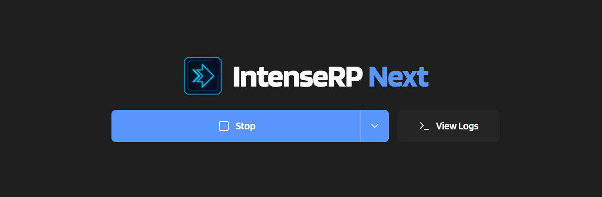
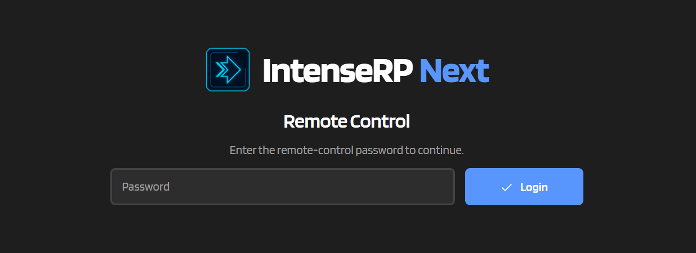
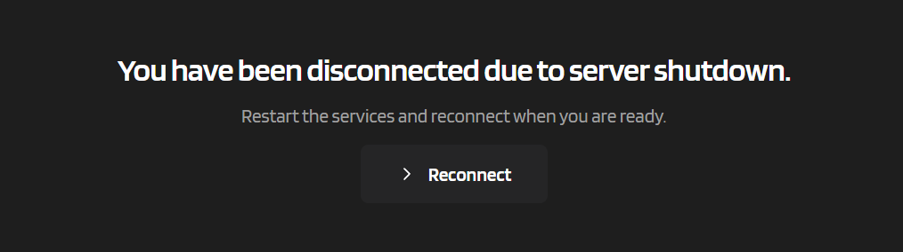

# :material-remote-desktop: Remote Control

Remote Control gives you a small browser UI for controlling a running IntenseRP instance from another device.

This feature is for those moments when you are, say, lying on the couch and want to restart the server or check logs without walking back to your PC. :)

!!! warning "LAN Use Recommended"
    It is meant for **localhost / LAN** use, best if you don't expose it to the public internet (unless you know what you're doing).

The remote page is served by the same FastAPI server as the OpenAI-compatible API, so it only exists while services are running. No running server means no remote page. This is done to reduce the overall impact, as otherwise we'd have two separate servers to maintain and secure instead of one + a supervisor.

!!! warning "Experimental"
    Remote Control is a beta feature and might not make it to later releases. Expect tweaks, UI changes, and occasional weird bugs. It is not yet considered stable, so use with caution.

    If you enable it, keeping a backup of your `[config_dir]` (see [Backup & Restore](../features/system.md#backup--restore)) is a very good idea.

---

## :material-toggle-switch: Enable It

:material-arrow-right: **Settings** -> **Advanced** -> **Experimental Features** -> **Enable Remote Control**

You can also set:

:material-arrow-right: **Settings** -> **Advanced** -> **Experimental Features** -> **Remote Control Password**

When enabled, the remote UI lives at:

```text
http://YOUR_HOST:YOUR_PORT/remote
```

If **Show the Server Address in Logs** is enabled in **Settings -> API Server -> Access**, IntenseRP logs the remote URL when services start up (useful if you forgot the URL or are connecting from another device).

---

## :material-remote-desktop: What You Actually Get



The remote page is intentionally tiny and simple. Right now it can do simple actions like **Stop**, **Restart**, **Hotswap**, **Switch Account**, and **Switch Models** / **Switch Loadouts**, as well as show you live logs + some minor stuff.

??? info "Hotswap targets"
    For Hotswap specifically, it shows every unlocked provider except the one you're currently using. Temporarily locked providers, such as Google AI Studio right now, only appear if **Ignore Provider Locks** is enabled.

??? info "Switch Models vs Switch Loadouts"
    If **Loadouts** are enabled, Remote Control uses **Switch Loadouts** instead of **Switch Models**, because the selected model is part of the active loadout. If Loadouts are disabled, providers that support direct model switching still show **Switch Models**.

??? info "Providers in Parallel"
    When **Providers in Parallel** is active and Loadouts are disabled, **Switch Models** gets a provider dropdown too. It only shows providers with a real model list, then lets you pick draft model changes and confirm them together. Single-provider mode keeps the simpler "tap a model and switch" behavior.

!!! note "Not a full dashboard"
    I intentionally did NOT recreate the entire UI in the remote page. Unlike the desktop app, this is not meant to be a full management dashboard, but rather a quick control panel for common actions when you're away from the host PC.

---

## :material-lock: Passwords and Tokens



If you want, you can set a password for the remote UI. This adds a simple login gate to prevent unauthorized access. By default none is set, you'll just get straight into the remote page.

That is allowed. Whether it is a good idea depends entirely on your network and your level of faith in the people/devices on it.

If you set a password:

- the remote UI asks for it before letting you in
- each device/session gets its own token after successful login
- tokens last **15 minutes** but are renewed on each use
- up to **5** successful remote sessions are kept at once
- older sessions are pruned
- changing the password invalidates the existing remote sessions

!!! note "Stored locally"
    Remote session data is stored in an encrypted local JSON file, just like the rest of IntenseRP's config secrets. The active session handling still happens in memory while the server is running.

To disable the password, just clear the field and save. This invalidates all existing sessions and lets anyone who can access the remote page in without a password.

---

## :material-shield-lock: IP Whitelist Still Applies

Remote Control also respects the existing IP whitelist.

If **Settings -> API Server -> Security -> Restrict Access by IP Address** is enabled, only whitelisted IPs can open the remote page, fetch logs, or perform remote actions.

This is especially useful if you know your device's IP and want to keep the remote UI passwordless, or if you want an extra layer of security on top of the password.

---

## :material-connection: Reconnect Flow



Some actions in the remote UI disconnect you because they restart or stop the very server that serves the page.

When that happens, you are redirected to a simple reconnect page that you can use to refresh the connection once the server is back up. This is intentional and expected behavior.

Those actions are:

- **Stop**
- **Restart**
- **Switch Account**
- **Hotswap**
- **Switch Loadouts**

Why? Because they all stop/restart the server underneath the page. After that, the remote UI shows a reconnect screen. Once the API server is back, you can reconnect and resume control without reopening the page.

---

## :material-help-circle: Quick FAQ

??? question "Why can't I open the remote page when services are stopped?"
    Because the remote page is served by the same FastAPI server as the API itself.

    If the server is not running, there is nothing listening at `/remote`.

??? question "Can I use Remote Control without a password?"
    Yes. Leave **Remote Control Password** blank.

    In that case, access control comes from your bind address / LAN setup / IP whitelist. This can be fine on a trusted local setup, but use common sense.

??? question "Does it share API keys with the normal API?"
    No. Remote Control has its own optional password-based login flow.

    API keys are for API clients.
    Remote Control password is for the browser UI.

??? question "Why did Stop / Restart / Hotswap disconnect me?"
    Because those actions restart or shut down the very server that is serving the page.

    The disconnect is expected. The reconnect screen is the intended flow.

??? question "Can I have multiple remote devices signed in?"
    Yes. Up to **5** successful remote sessions are kept at once.

    If you keep signing in from more devices than that, the older ones get pruned.
