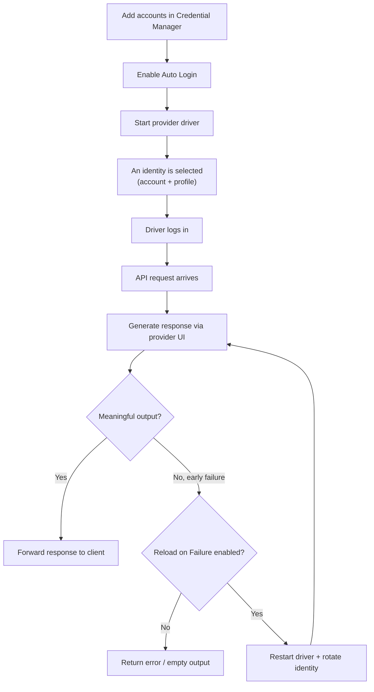

# :material-account-switch: Accounts & Credentials

IntenseRP manages provider logins using an account-based Credential Manager.

There's nothing to enable - this is the standard way IntenseRP manages credentials now.

You can store **multiple accounts per provider**, let IntenseRP pick one on start, and (optionally) **retry a failed request by restarting the browser and rotating to a different identity**.

---

## :material-information: Recommended setup

1. Keep **Persistent Sessions** enabled (it's on by default) so you stay logged in between restarts.
2. If you want Auto Login on **DeepSeek / GLM Chat / QwenLM / Google AI Studio**, enable **Auto Login** and add at least one account in **Credential Manager**.
3. Keep a backup of your `[config_dir]` (Settings -> System -> Backup & Restore).
4. (Optional) Enable:
    - **Select Least Used**: spreads usage across accounts
    - **Reload on Failure**: retries early failures with a rotated identity

---

## :material-lightbulb: The big picture



Under the hood, accounts are used by the drivers at login time, and by the request retry logic when it decides whether to rotate and try again.

---

## :material-play-circle: Quick setup

1. Open **Settings**.
2. Go to **Providers & Credentials**.
3. (Optional) Enable **Auto Login** (DeepSeek / GLM Chat / QwenLM / Google AI Studio).
4. Open **Credential Manager** and add one or more accounts for your provider.
5. (Optional) Enable **Select Least Used** and/or **Reload on Failure**.
6. Click **Save**, then **Stop -> Start** the provider driver (so changes take effect).

!!! note "Migration from older versions"
    If you previously used the old per-provider fields (single email/password), IntenseRP automatically imports them into Credential Manager on startup (before you open it).

    If you already have accounts saved for a provider, IntenseRP will not overwrite them with legacy credentials.

### Settings overview

| Setting | Where | What it does |
|---|---|---|
| **Credential Manager** | Settings -> Providers & Credentials | Add and manage accounts per provider |
| **Auto Login** | Settings -> Providers & Credentials | Uses a saved account for login (DeepSeek / GLM Chat / QwenLM / Google AI Studio) |
| **Select Least Used** | Settings -> Providers & Credentials | Chooses the least recently used account when starting the driver |
| **Reload on Failure** | Settings -> Providers & Credentials | On early failures, restarts the driver and retries once with a rotated identity |

---

## :material-account-switch: How account selection works

Accounts are stored per provider (DeepSeek / GLM Chat / Moonshot / QwenLM / Google AI Studio).

When **Auto Login** is enabled, IntenseRP selects an account on driver start and logs in automatically. If **Auto Login** is disabled, you can still log in manually and use **Persistent Sessions** to stay signed in between restarts.

There are two selection modes:

- If **Select Least Used** is disabled, IntenseRP picks a random account from the list.
- If **Select Least Used** is enabled, IntenseRP prefers the account that was used the longest time ago (accounts that have never been used are preferred first).

This is tracked in an internal "last used" map stored alongside the encrypted credentials.

!!! tip "Want to force a specific account?"
    For now, you cannot pin a specific row. If you need a specific account, keep only that account in Credential Manager (remove others temporarily).

---

## :material-cookie: Persistent Sessions (profiles)

Persistent Sessions works the same way as always: it stores a reusable browser profile (cookies, local storage, etc.) so you stay logged in between restarts.

IntenseRP stores one profile per identity (account or manual) under:

```
[config_dir]/playwright_profiles/accounts/deepseek/<hash>/
[config_dir]/playwright_profiles/accounts/glm_chat/<hash>/
[config_dir]/playwright_profiles/accounts/moonshot_kimi/<hash>/
[config_dir]/playwright_profiles/accounts/qwenlm/<hash>/
[config_dir]/playwright_profiles/accounts/aistudio/<hash>/
```

The `<hash>` is derived from your email (SHA-256, truncated). It's only there so your email doesn't show up in folder names.

If no account is selected (for example Auto Login is off / manual login), the profile name falls back to:

```
[config_dir]/playwright_profiles/accounts/<provider>/manual
```

!!! note "Older installs may have Legacy profiles"
    Older versions stored profiles directly under:
    `playwright_profiles/<provider>/`.
    The Settings UI can still list and delete both Legacy and account-based profiles.

---

## :material-refresh: Reload on Failure (auto retry)

This option is meant to handle cases where a provider fails early and returns no meaningful output (for example, a rate limit / quota style error).

When enabled, each request gets up to **two attempts**. If the first attempt produces no meaningful output, IntenseRP restarts the driver, rotates the identity, and retries once.

!!! note "This restarts the browser"
    The retry is implemented by closing and restarting the provider driver, which means the provider browser window is relaunched.

### What "rotate identity" means

IntenseRP tries two strategies, in this order:

1. Switch to a different **account** (another saved login), if you have more than one.
2. If there's only one account available, create a new **profile slot** for that same account (a fresh browser profile) and restart.

The second option is most useful when **Persistent Sessions** are enabled, because it forces a clean session/profile for the same login.

---

## :material-lock: Where account data is stored (and how secure it is)

Credential Manager stores its data inside your config directory:

```
[config_dir]/accounts/credentials.json.enc
[config_dir]/accounts/usage.json.enc
```

These files are encrypted using the same `settings.key` used for your main settings file:

```
[config_dir]/settings.key
```

!!! note "Security reality check"
    This is encryption-at-rest for the config files, not a password manager. If someone has access to your config directory, they can usually access the key too. Treat `[config_dir]` as sensitive.

---

## :material-chat-alert: Provider notes

**DeepSeek:** if Auto Login is enabled but no DeepSeek accounts are configured, IntenseRP waits for manual login.

**GLM Chat:** IntenseRP can fill email/password, but GLM still requires a CAPTCHA step. Persistent Sessions are strongly recommended so you don't have to repeat the CAPTCHA every start.

**Moonshot:** login is Google-based and may still require manual confirmation/challenges depending on your account security settings.

**QwenLM:** standard email/password login. Auto Login can fill credentials automatically.

**Google AI Studio:** Google login with optional credential autofill. Persistent Sessions are strongly recommended because Google may still ask for manual confirmation/challenge steps.

---

## :material-frequently-asked-questions: Quick FAQ

??? question "Where did the provider email/password fields go?"
    Use **Settings -> Providers & Credentials -> Credential Manager**.

??? question "Do I need to open Credential Manager after updating?"
    Usually no. If you had legacy saved credentials, IntenseRP imports them automatically on startup.

??? question "How do I switch accounts?"
    - Enable **Select Least Used** to spread usage across accounts, or
    - Use **Switch Account** in the Stop menu, or
    - Enable **Reload on Failure** so early failures can trigger an automatic rotation.

??? question "Can I see which account is active?"
    Not in the UI yet. You can usually tell from the UI of the provider's frontend, as it often shows the logged-in email or profile name. In the future, I may add an indicator in IntenseRP's UI as well.

---

## :material-arrow-right: Related pages

[:material-key: Login & Sessions](login-sessions.md)

[:material-cog: System (config dir, profiles, backups)](system.md)

[:material-bug: Troubleshooting](../hands/troubleshooting.md)
