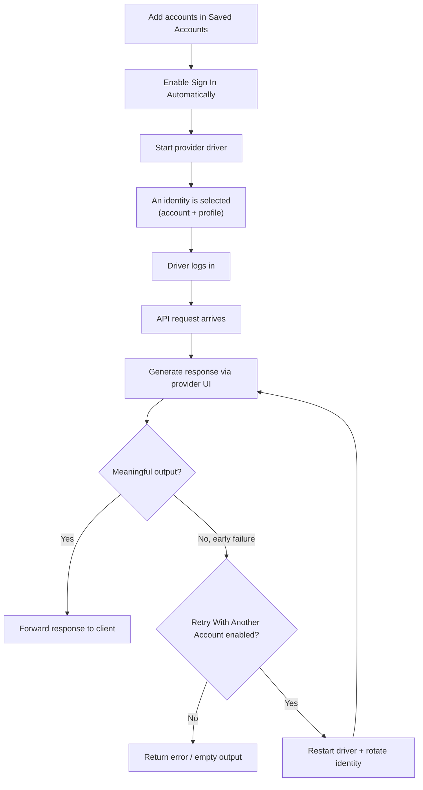

# :material-account-switch: Accounts & Credentials

IntenseRP manages provider logins using an account-based saved-accounts system.

There's nothing to enable - this is the standard way IntenseRP manages credentials now.

You can store **multiple accounts per provider**, let IntenseRP pick one on start, **pin a specific one when you want a predictable startup profile**, and (optionally) **retry a failed request by restarting the browser and rotating to a different identity**.

---

## :material-information: Recommended setup

1. Keep **Persistent Sessions** enabled (it's on by default) so you stay logged in between restarts.
2. If you want auto-login for your provider, enable **Sign In Automatically** and add at least one account in **Saved Accounts**.
3. Keep a backup of your `[config_dir]` (see [Backup & Restore](system.md#backup--restore)).
4. (Optional) Enable:
    - **Prefer the Least Used Account**: spreads usage across accounts
    - **Retry With Another Account**: retries early failures with a rotated identity
    - **Pin** in **Saved Accounts**: forces a specific row to be used on normal startup
    - **Disable** in **Saved Accounts**: keeps a row saved but removes it from selection/rotation

---

## :material-lightbulb: The big picture



Under the hood, accounts are used by the drivers at login time, and by the request retry logic when it decides whether to rotate and try again.

---

## :material-play-circle: Quick setup

1. Open **Settings**.
2. Go to **Provider and Login**.
3. In **Sign-In and Accounts**, (optional) enable **Sign In Automatically**.
4. Open **Saved Accounts** and add one or more accounts for your provider.
5. (Optional) Enable **Prefer the Least Used Account** and/or **Retry With Another Account**.
6. Click **Save**, then **Stop -> Start** the provider driver (so changes take effect).

!!! note "Migration from older versions"
    If you previously used the old per-provider fields (single email/password), IntenseRP automatically imports them into **Saved Accounts** on startup (before you open it).

    If you already have accounts saved for a provider, IntenseRP will not overwrite them with legacy credentials.

### Settings overview

| Setting | Where | What it does |
|---|---|---|
| **Saved Accounts** | Settings -> Provider and Login -> Sign-In and Accounts | Add and manage accounts per provider, including pinning and disabling rows |
| **Sign In Automatically** | Settings -> Provider and Login -> Sign-In and Accounts | Uses a saved account for login |
| **Prefer the Least Used Account** | Settings -> Provider and Login -> Sign-In and Accounts | Chooses the least recently used account when starting the driver, unless a row is pinned |
| **Retry With Another Account** | Settings -> Provider and Login -> Sign-In and Accounts | On early failures, restarts the driver and retries once with a rotated identity |

---

## :material-account-switch: How account selection works

Accounts are stored per provider (DeepSeek / GLM Chat / Moonshot / QwenLM / Perplexity / HuggingChat / Google AI Studio / Xiaomi MiMo).

When **Sign In Automatically** is enabled, IntenseRP selects an account on driver start and logs in automatically. If it is disabled, you can still log in manually and use **Keep Provider Sessions Signed In** to stay signed in between restarts.

There are basically 3 startup cases:

- If a row is **pinned**, that row wins on normal startup.
- If nothing is pinned and **Prefer the Least Used Account** is disabled, IntenseRP picks a random account from the list.
- If nothing is pinned and **Prefer the Least Used Account** is enabled, IntenseRP prefers the account that was used the longest time ago (accounts that have never been used are preferred first).

This is tracked in an internal "last used" map stored alongside the encrypted credentials.

### Pinning a row

Open the little `...` button on any Saved Accounts row and click **Pin**.

This feature is meant to force a specific account/profile to be used on normal startup. It does not affect the retry logic, so if **Retry With Another Account** is enabled, an early failure can still trigger a rotation away from the pinned row.

The current pinned row (if any) is also indicated in the startup logs with `[PINNED]` next to the profile name, and with a green pin icon in the Saved Accounts list.

!!! note "1 pinned row per provider"
    You can only pin 1 row per provider. Pinning another row automatically unpins the previous one.

### Disabling a row

Open the little `...` button on any Saved Accounts row and click **Disable**.

Disabled rows stay visible and dimmed, but IntenseRP will not use them for startup selection, least-used rotation, full parallel lanes, or retry-with-another-account recovery.

This is especially useful for providers with monthly limits. For example, when a HuggingChat account hits its monthly credits, disable that row until the quota resets.

!!! note "At least one enabled account"
    If a provider has saved rows, at least one row must stay enabled. Otherwise Auto Login would have credentials saved but no usable identity to pick.

---

## :material-cookie: Persistent Sessions (profiles)

Persistent Sessions works the same way as always: it stores a reusable browser profile (cookies, local storage, etc.) so you stay logged in between restarts.

IntenseRP stores one profile per identity (account or manual) under:

```
[config_dir]/playwright_profiles/accounts/deepseek/<hash>/
[config_dir]/playwright_profiles/accounts/glm_chat/<hash>/
[config_dir]/playwright_profiles/accounts/moonshot_kimi/<hash>/
[config_dir]/playwright_profiles/accounts/qwenlm/<hash>/
[config_dir]/playwright_profiles/accounts/perplexity/<hash>/
[config_dir]/playwright_profiles/accounts/huggingchat/<hash>/
[config_dir]/playwright_profiles/accounts/aistudio/<hash>/
[config_dir]/playwright_profiles/accounts/mimo/<hash>/
```

The `<hash>` is derived from your email (SHA-256, truncated). It's only there so your email doesn't show up in folder names.

If no account is selected (for example Auto Login is off / manual login), the profile name falls back to:

```
[config_dir]/playwright_profiles/accounts/<provider>/manual
```

!!! note "Older installs may have Legacy profiles"
    Older versions stored profiles directly under:
    `playwright_profiles/<provider>/`.
    The Settings UI can still list and delete both Legacy and account-based profiles.

---

## :material-refresh: Retry With Another Account

This option is meant to handle cases where a provider fails early and returns no meaningful output (for example, a rate limit / quota style error).

When enabled, each request gets up to **two attempts**. If the first attempt produces no meaningful output, IntenseRP restarts the driver, rotates the identity, and retries once.

!!! note "This restarts the browser"
    The retry is implemented by closing and restarting the provider driver, which means the provider browser window is relaunched.

### What "rotate identity" means

IntenseRP tries two strategies, in this order:

1. Switch to a different **account** (another saved login), if you have more than one.
2. If there's only one account available, create a new **profile slot** for that same account (a fresh browser profile) and restart.

The second option is most useful when **Persistent Sessions** are enabled, because it forces a clean session/profile for the same login.

If a row is pinned, that only affects the normal startup pick. The retry path can still rotate away from it if recovery is needed.

---

## :material-lock: Where account data is stored (and how secure it is)

The Saved Accounts manager stores its data inside your config directory:

```
[config_dir]/accounts/credentials.json.enc
[config_dir]/accounts/usage.json.enc
```

These files are encrypted using the same `settings.key` used for your main settings file:

```
[config_dir]/settings.key
```

!!! note "Security reality check"
    This is encryption-at-rest for the config files, not a password manager. If someone has access to your config directory, they can usually access the key too. Treat `[config_dir]` as sensitive.

---

## :material-chat-alert: Provider notes

**DeepSeek:** if Auto Login is enabled but no DeepSeek accounts are configured, IntenseRP waits for manual login.

**GLM Chat:** IntenseRP can fill email/password, but GLM still requires a CAPTCHA step. Persistent Sessions are strongly recommended so you don't have to repeat the CAPTCHA every start.

**Moonshot:** login is Google-based. Auto Login can try to fill the popup, but Google may still require manual confirmation/challenges depending on your account security settings.

**QwenLM:** standard email/password login. Auto Login can fill credentials automatically.

**Perplexity:** email-code login. Auto Login can fill the email and start the code flow, but you still need to enter the 6-digit code in the browser. Password can be left blank in Saved Accounts.

**HuggingChat:** username/email + password login. HuggingChat monthly credits are small (`$0.1/month` for free accounts, `$2/month` for Pro), so add multiple accounts if you have them and disable rows that hit the monthly limit until they reset.

**Google AI Studio:** Google login with optional credential autofill. Persistent Sessions are strongly recommended because Google may still ask for manual confirmation/challenge steps.

**Xiaomi MiMo:** Xiaomi account login with email/password and an agreement checkbox. MiMo is heavily region-dependent, so if the page itself refuses to connect, configure a MiMo proxy or use a VPN before troubleshooting credentials.

---

## :material-frequently-asked-questions: Quick FAQ

??? question "Where did the provider email/password fields go?"
    Use **Settings -> Provider and Login -> Sign-In and Accounts -> Saved Accounts**.

??? question "Do I need to open Saved Accounts after updating?"
    Usually no. If you had legacy saved credentials, IntenseRP imports them automatically on startup.

??? question "How do I switch accounts?"
    - Enable **Prefer the Least Used Account** to spread usage across accounts, or
    - Pin a specific Saved Accounts row if you want startup to always land on that one, or
    - Use **Switch Account** in the Stop menu, or
    - Enable **Retry With Another Account** so early failures can trigger an automatic rotation.

??? question "Can I see which account is active?"
    There is still no always-visible indicator in the main UI, but startup logs now show the selected profile/email when services launch.

    If the startup choice came from a pinned row, the log line also includes `[PINNED]`.

---

## :material-arrow-right: Related pages

[:material-key: Login & Sessions](login-sessions.md)

[:material-cog: System (config dir, profiles, backups)](system.md)

[:material-bug: Troubleshooting](../hands/troubleshooting.md)
