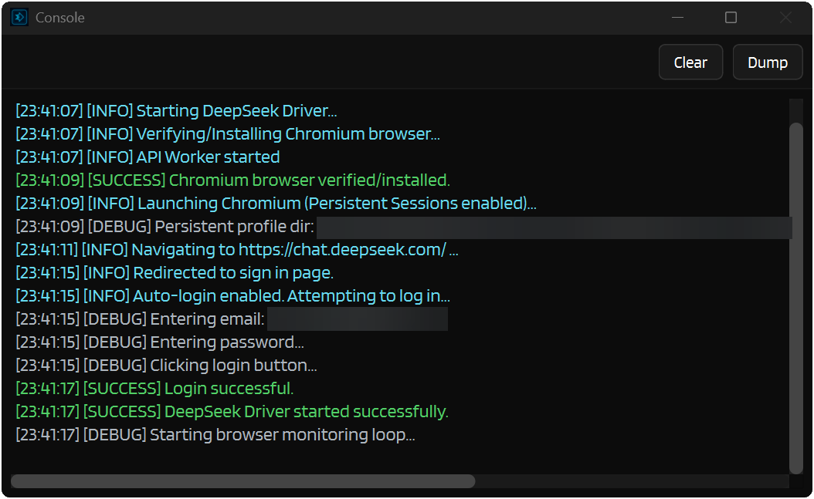
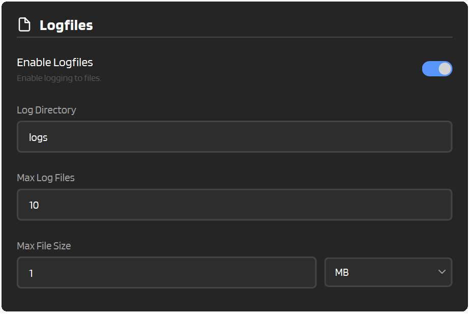

# :material-console: Console & Logging

IntenseRP comes with some pretty handy logging features to help you keep an eye on what's happening (and figure out what went wrong when it inevitably does). This page covers the console window, file logging, and how to export logs for debugging.

---

## :material-monitor: The Console Window

The console is a separate window that shows real-time logs with color-coded messages. Very useful for seeing what IntenseRP is up to behind the scenes.



### Enabling the Console

:material-arrow-right: **Settings** → **Logs and Troubleshooting** → **Console Window** → **Open a Console Window**

When you turn this on, a console window pops up showing everything happening in real-time. You can minimize it, but it won't close until you disable it in settings.

!!! tip "When to Use What"

    - **Running from binaries?** Use the console window or file logging as you run in GUI mode.
    - **Running from source?** Log to Stdout works great since you already have a terminal open.

### Log Levels

Messages are color-coded so you can spot problems at a glance:

| Level | Color | What It Means |
|-------|-------|---------------|
| :material-circle:{ style="color: #ADB5BD" } **DEBUG** | <span style="color: #ADB5BD">Gray</span> | Detailed internal info (mostly for developers) |
| :material-circle:{ style="color: #66D9EF" } **INFO** | <span style="color: #66D9EF">Cyan</span> | General activity updates |
| :material-circle:{ style="color: #51CF66" } **SUCCESS** | <span style="color: #51CF66">Green</span> | Something completed successfully |
| :material-circle:{ style="color: #FFD43B" } **WARNING** | <span style="color: #FFD43B">Yellow</span> | Something might be off, but not critical |
| :material-circle:{ style="color: #FF6B6B" } **ERROR** | <span style="color: #FF6B6B">Red</span> | Something broke |

### Color Palettes

Not a fan of the default colors? Sure then, pick your poison :upside_down:

:material-arrow-right: **Settings** → **Logs and Troubleshooting** → **Console Window** → **Color Theme**

| Palette | Style |
|---------|-------|
| **Modern** | Softer, muted colors (the default) |
| **Classic** | The original IntenseRP API color scheme |
| **Bright** | A brighter, punchier version of Modern |

### Console Appearance

Just a few more tweaks to make it your own:

| Setting | What It Does |
|---------|-------------|
| **Max Line Limit** | How many lines to keep before old ones get trimmed (default: 500) |
| **Font Size** | Text size in the console (default: 10 but I prefer 12) |
| **Wrap Lines** | Soft-wrap long lines to reduce horizontal scrolling |
| **Auto-Scroll Mode** | When to follow new logs: Always / Bottom only / Never |
| **Always On Top** | Keep the console above other windows |

!!! warning "Always On Top"
    This can sometimes cause issues on startup - the console might grab focus or get in the way. Only enable it if you really need it.

---

## :material-routes: Log Routing

When the console is enabled, you get some control over where logs end up:

| Setting | What It Does |
|---------|-------------|
| **Log to Main** | Shows logs in the Activity Log on the main window |
| **Log to Stdout** | Prints logs to the terminal (useful if you're running from source) |

!!! note
    If the console is disabled, both of these are forced on so you don't miss anything important.

---

## :material-filter: Logging Levels

Each output target has its own minimum severity threshold. Messages below the chosen level are silently dropped for that target, so you can keep your terminal quiet while still logging everything to a file, for example.

:material-arrow-right: **Settings** → **Logs and Troubleshooting** → **Logging Levels**

| Setting | Controls | Default |
|---------|----------|---------|
| **Stdout** | What gets printed to the terminal | Debug |
| **Console Window** | What appears in the console window | Debug |
| **Mini-Console** | What shows up in the Activity Log (main window) | Success |
| **Logfiles** | What gets written to log files | Debug |

### Severity Order

Levels are ordered from most verbose to least verbose:

**Debug** → **Success** → **Info** → **Warning** → **Error**

Setting a target to "Warning" means it only receives Warning and Error messages. Setting it to "Debug" means it gets everything.

!!! tip "Practical Defaults"
    The defaults are tuned so the Mini-Console stays clean (no debug noise) while everything else captures full detail. If you're hunting a specific issue, try setting the relevant target to Debug temporarily.

---

## :material-file-document: File Logging

But what if you want to keep logs for later? Enter Logfiles - IntenseRP can save logs to timestamped files for you to review or share.

:material-arrow-right: **Settings** → **Logs and Troubleshooting** → **Log to Files** → **Log to Files**



### Configuration

| Setting | What It Does | Default |
|---------|-------------|---------|
| **Log Directory** | Where log files get saved | `logs` |
| **Max Log Files** | How many files to keep before deleting the oldest | 5 |
| **Max File Size** | Maximum size per file before it rotates | 10 MB |

### How Rotation Works

When a log file hits the max size:

1. The current file is closed
2. Old lines get trimmed from the beginning
3. If there are too many files, the oldest one is deleted

This keeps logs from growing indefinitely and eating up your disk space.

### Log File Names

Files get timestamped names:

```
logs/
  log_2025-12-19_11_49_00.txt
  log_2025-12-19_12_15_30.txt
  log_2025-12-19_12_30_05.txt
```

---

## :material-download: Console Dumping

Sometimes you need to save whatever's currently in the console - maybe to share with someone or just review later. That's what dumping is for.

### How to Dump

1. Open the console window
2. Hit the **Dump** button in the top-right corner
3. Pick a directory (or it'll use your default dump directory)
4. Done! A file appears with a timestamp: `condump_2100-01-01_00-00-01.txt`

### Dump Settings

:material-arrow-right: **Settings** → **Console Dumping**

| Setting | What It Does |
|---------|-------------|
| **Confirm Clear** | Ask before clearing the console (on by default) |
| **Condump Directory** | Default folder for dumps (leave blank to ask each time) |

---

## :material-bug: Troubleshooting with Logs

When things go sideways, logs are your best friend. Usually that's where you'll be going to figure out what went wrong.

!!! tip "Want a full troubleshooting checklist?"
    See [:material-bug: Troubleshooting](../hands/troubleshooting.md) for common fixes and how to file a good bug report.

### What to Look For

1. **ERROR messages** - Usually tell you exactly what blew up
2. **WARNING messages** - Might hint at the root cause
3. **Timing** - When did it break? What happened right before?

### Sharing Logs

If you need to share logs with the developer or community:

1. **Dump the console** or grab the log file
2. **Review the contents** before sharing (see the big scary warning below)
3. Upload to a paste service or attach to your bug report on GitHub (pretty sure it can handle 15kb of text)

!!! danger "Review Before Sharing!"
    Log files and console dumps can contain sensitive stuff:
    
    - **Your provider email address** (shows up during auto-login)
    - **File paths** that might reveal your username or folder structure
    - **Message content** in debug logs
    - **API keys** if you're debugging auth issues
    
    :material-alert::material-alert::material-alert::material-alert: **Always check and redact any personal info before sharing logs publicly!** :material-alert::material-alert::material-alert::material-alert:

### Common Error Patterns

??? example "Browser won't launch"
    Look for errors mentioning:

    - `Failed to launch` - Browser installation issue
    - `chromium` or `playwright` - Missing browser components
    - `ENOENT` - File or directory not found

??? example "Login failing"
    Look for:

    - `sign_in` - Being redirected to login page
    - `Error during auto-login` - Credential or form problems
    - Timeout errors - Page not loading fast enough

??? example "Request errors"
    Look for:
    
    - `HTTP` status codes (401, 403, 500, etc.)
    - `Connection refused` - Server not reachable
    - `Timeout` - Request took too long

---

## :material-format-list-checks: Quick Reference

### Console Settings

| Setting | Default | What It Does |
|---------|---------|-------------|
| Enable Console | Off | Shows the console window |
| Log to Main | On | Shows logs in main window |
| Log to Stdout | On | Prints to terminal |
| Max Line Limit | 500 | Lines before trimming |
| Font Size | 10 | Console text size |
| Wrap Lines | Off | Soft-wrap long lines |
| Auto-Scroll Mode | Always | Auto-scroll behavior |
| Color Palette | Modern | Color scheme |
| Always On Top | Off | Keeps console above other windows |

### Logging Levels

| Setting | Default | What It Does |
|---------|---------|-------------|
| Stdout | Debug | Minimum severity for terminal output |
| Console Window | Debug | Minimum severity for the console window |
| Mini-Console | Success | Minimum severity for the Activity Log |
| Logfiles | Debug | Minimum severity for log files |

### Logfiles

| Setting | Default | What It Does |
|---------|---------|-------------|
| Enable Logfiles | Off | Saves logs to files |
| Log Directory | `logs` | Where files go |
| Max Log Files | 5 | Files before rotation |
| Max File Size | 10 MB | Size before rotation |

### Console Dumping

| Setting | Default | What It Does |
|---------|---------|-------------|
| Confirm Clear | On | Ask before clearing |
| Condump Directory | (blank) | Default dump location |

---

## :material-arrow-left: Back to Features

[:material-arrow-left: Features Overview](../features.md)
