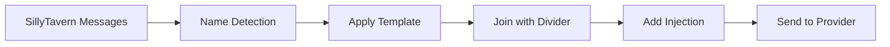
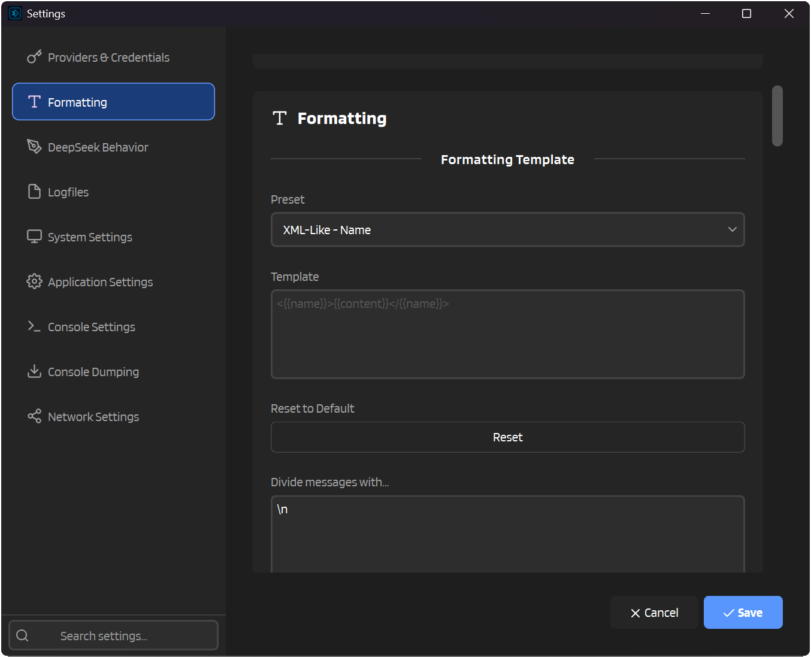
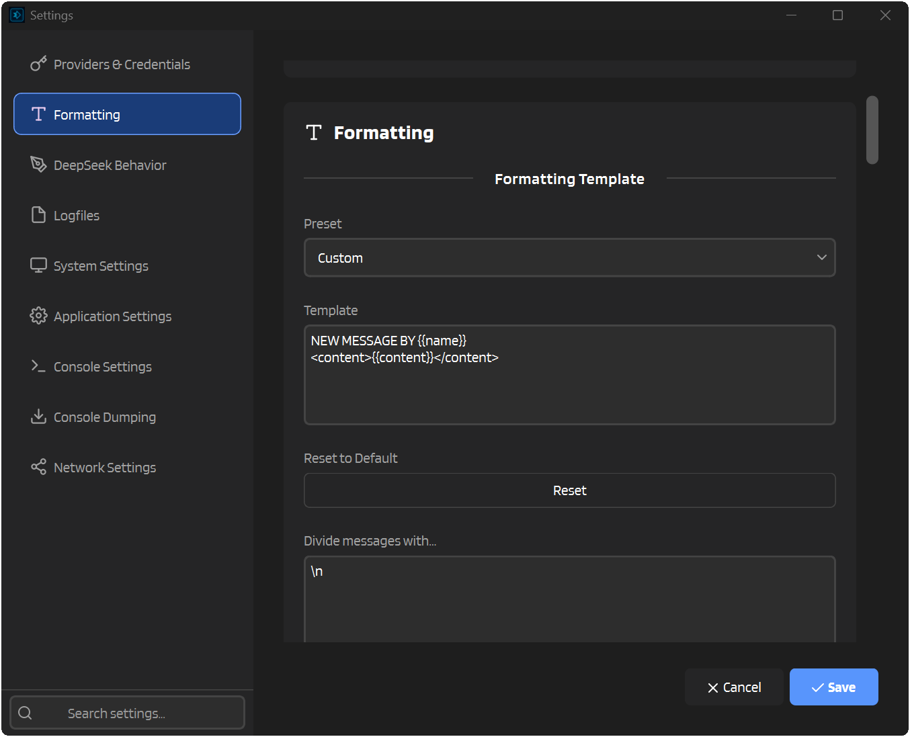
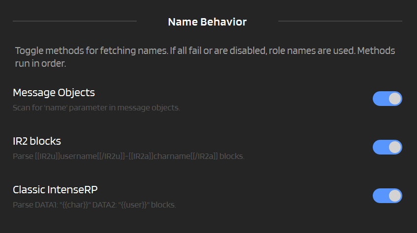
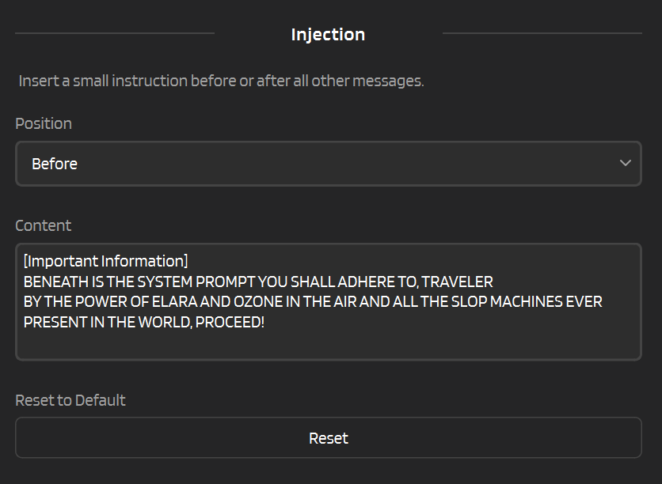

# :material-format-text: Formatting

When SillyTavern sends messages to IntenseRP, it doesn't just forward them straight to the active provider. Instead, it squishes everything into a single, neatly formatted prompt that the model can understand better. This page explains how that magic works.

---

## :material-lightbulb: The Big Picture

Here's what happens when you send a message:



1. **Name Detection** — Figure out who's talking (your character, the AI character, etc.)
2. **Apply Template** — Format each message using your chosen template
3. **Join with Divider** — Combine all messages with a separator (usually a newline)
4. **Add Injection** — Optionally prepend or append extra instructions
5. **Send to Provider** - Off it goes!

---

## :material-file-document-edit: Templates

Templates control how each message looks. They use placeholders that get replaced with actual values.

### Placeholders

| Placeholder | What It Becomes |
|-------------|-----------------|
| `{{name}}` | The character's name (e.g., "Sophie", "Jan") |
| `{{role}}` | The role type: "User", "Character", or "System" |
| `{{content}}` | The actual message text |

### Example

Let's say you have a message from your character named "Sophie" that says "Hello there!"

With the template `{{name}}: {{content}}`, it becomes:

```
Sophie: Hello there!
```

With `<{{name}}>{{content}}</{{name}}>`, it becomes:

```xml
<Sophie>Hello there!</Sophie>
```

---

## :material-palette: Presets

Don't want to write your own template? That's fine! I wouldn't either. IntenseRP comes with several built-in presets you can choose from.



### Classic

The default, simple format. Good for most use cases. Originally used by IntenseRP API.

=== "Classic - Name"

    **Template:** `{{name}}: {{content}}`
    
    **Example output:**
    ```
    Sophie: Hello there!
    Jan: Hey, what's up?
    ```

=== "Classic - Role"

    **Template:** `{{role}}: {{content}}`
    
    **Example output:**
    ```
    Character: Hello there!
    User: Hey, what's up?
    ```

### XML-Like

Wraps messages in XML-style tags. Some models respond well to this structured format.

=== "XML-Like - Name"

    **Template:** `<{{name}}>{{content}}</{{name}}>`
    
    **Example output:**
    ```xml
    <Sophie>Hello there!</Sophie>
    <Jan>Hey, what's up?</Jan>
    ```

=== "XML-Like - Role"

    **Template:** `<{{role}}>{{content}}</{{role}}>`
    
    **Example output:**
    ```xml
    <Character>Hello there!</Character>
    <User>Hey, what's up?</User>
    ```

### Divided

Uses markdown-style headers to separate messages. Visually clear and easy to read.

=== "Divided - Name"

    **Template:** `### {{name}}\n{{content}}`
    
    **Example output:**
    ```markdown
    ### Sophie
    Hello there!
    ### Jan
    Hey, what's up?
    ```

=== "Divided - Role"

    **Template:** `### {{role}}\n{{content}}`
    
    **Example output:**
    ```markdown
    ### Character
    Hello there!
    ### User
    Hey, what's up?
    ```

### Custom

Want to go wild? Select **Custom** and write your own template. Mix and match placeholders however you like!



---

## :material-arrow-split-horizontal: Message Divider

The divider is what goes *between* each formatted message. By default, it's just a newline (`\n`), but you can change it to anything.

| Divider | Result |
|---------|--------|
| `\n` (default) | Messages on separate lines |
| `\n\n` | Double-spaced messages |
| `---\n` | Horizontal rules between messages |
| ` ` (space) | All messages on one line (chaos mode) |

!!! tip "Escape Sequences"
    Type `\n` to insert a newline. It'll be converted to an actual line break when formatting. You can just press Enter in the input box too, if you prefer.

---

## :material-account-search: Name Detection

IntenseRP tries to figure out who's who in your conversation. It looks for names in a few different places, depending on what your client sends.



### How It Works

IntenseRP checks these sources **in order**:

1. **Message Objects** — The `name` field in each message (or legacy `irp-next` for RossAscends's STMP patcher compat)
2. **IR2 Blocks** — Special tags in system messages
3. **Classic IntenseRP** — Legacy `DATA1`/`DATA2` format

If none of these work, it falls back to generic names: "User" and "Character".

### Message Objects

The OpenAI API format lets you include a `name` field with each message:

```json
{
  "role": "user",
  "name": "Sophie",
  "content": "Hello!"
}
```

When enabled, IntenseRP reads this `name` and uses it for `{{name}}` in your template.

:material-arrow-right: **Settings** → **Formatting** → **Name Behavior** → **Message Objects**

!!! note "STMP patcher compatibility (RossAscends's STMP)"
    If your client (like RossAscends's STMP) sends `irp-next` instead of `name`, IntenseRP treats it exactly like `name` (when Message Objects is enabled).

!!! warning "SillyTavern Setup Required"
    For SillyTavern to actually send these names, you need to configure it:
    
    :material-arrow-right: **SillyTavern** → **User Settings** → **Character Names Behavior** → **Message**
    
    Without this, SillyTavern won't include the `name` field in messages, and IntenseRP won't have anything to detect.

!!! success "Recommended"
    Using Message Objects is the most reliable way to pass character names. If your client supports it, always enable this option first.

### IR2 Blocks

IR2 (short for "IntenseRP 2") is a simple, machine-readable way to embed character names in system messages. It's not a standard - just something I made up to reliably pass names through:

```
[[IR2u]]{{user}}[[/IR2u]]-[[IR2a]]{{char}}[[/IR2a]]
```

This tells IntenseRP that the user is "Sophie" and the AI character is "Jan".

:material-arrow-right: **Settings** → **Formatting** → **Name Behavior** → **IR2 Blocks**

### Classic IntenseRP

The original IntenseRP format from way back:

```
DATA1: "{{char}}" DATA2: "{{user}}"
```

Where `DATA1` is the character name and `DATA2` is the user name. (Yes, it's backwards. Don't ask.)

:material-arrow-right: **Settings** → **Formatting** → **Name Behavior** → **Classic IntenseRP**

!!! note "Priority"
    Methods are checked in order. If Message Objects finds a name, it won't bother checking IR2 or Classic. You can toggle each method on or off depending on what your client sends.

---

## :material-needle: Injection

Sometimes you want to add a little extra instruction to every prompt — like a reminder to stay in character or follow certain rules. That's what injection does.



### How It Works

Injection adds your custom text either **before** or **after** all other formatted messages.

| Position | Where It Goes |
|----------|---------------|
| **Before** | At the very beginning of the prompt |
| **After** | At the very end of the prompt |

!!! tip "Injection placeholders"
    Injection content supports these placeholders:

    | Placeholder | Replaced with |
    |---|---|
    | `{{user}}` | Detected user name |
    | `{{char}}` | Detected character name |

    The names come from the same Name Detection system (Message Objects, IR2 blocks, or Classic IntenseRP tags).

### Example

If your injection content is:

```
[Remember: Stay in character at all times]
```

And your position is **Before**, the final prompt looks like:

```
[Remember: Stay in character at all times]
Sophie: Hello there!
Jan: Hey, what's up?
```

### Setting It Up

1. Choose your **Position** (Before or After)
2. Enter your **Content**
3. Save!

!!! tip "Use Cases"
    - Add a "jailbreak" or instruction at the start
    - Append reminders about formatting or behavior
    - Insert context that should always be present

---

## :material-toggle-switch: Disabling Formatting

If you want IntenseRP to pass messages through without any formatting, just turn it off:

:material-arrow-right: **Settings** → **Formatting** → **Apply Formatting** → Off

When disabled, messages are formatted as simple `role: content` pairs:

```
user: Hello there!
assistant: Hey, what's up?
```

---

## :material-frequently-asked-questions: Quick FAQ

??? question "My character names aren't showing up?"
    Make sure at least one name detection method is enabled. If you're using SillyTavern, check that **Character Names Behavior** is set to **Message** in User Settings. Otherwise SillyTavern won't send the names at all.

??? question "Can I use multiple lines in my template?"
    Yes! Use `\n` for newlines in your template. For example: `{{name}}\n{{content}}` puts the name on its own line.

??? question "What if I just want raw messages?"
    Turn off **Apply Formatting** and IntenseRP will pass messages through with minimal processing.

??? question "What's the difference between IR2 and Classic IntenseRP?"
    IR2 is the newer format with XML-like tags (`[[IR2u]]...[[/IR2u]]`). Classic uses `DATA1`/`DATA2` strings. Both do the same thing - they pass character names - but IR2 is cleaner and less likely to be accidentally parsed as content. It's deliberately designed to be written in a way that absolutely no normal user message would ever contain it.

---

## :material-arrow-left: Back to Features

[:material-arrow-left: Features Overview](../features.md)
