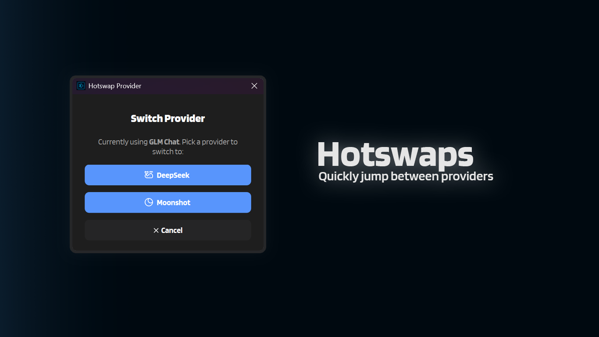

# :material-swap-horizontal: Hotswaps

Hotswaps let you switch between AI providers without opening the Settings window. Instead of navigating to **Provider and Login**, changing **Current Provider**, saving, stopping, and starting again, you can do it all in one or two clicks.

---

## :material-cog-outline: How It Works

When you trigger a Hotswap, IntenseRP shows a small dialog with the providers you're **not** currently using. Pick one, and IntenseRP will:

1. Update your **Provider** setting to the new provider
2. If services are running, automatically restart the browser (stop + start)
3. If services are running, launch the new provider's web UI

That's it. Your other settings (credentials, behavior toggles, etc.) are untouched.

!!! tip "No data loss"
    Hotswapping is equivalent to changing **Current Provider** in Settings and clicking Start again. Your browser profiles, saved accounts, and behavior settings for each provider are preserved.

---

## :material-tune: Hotswap Button Style

You can choose between two small-button styles for the Hotswap shortcut:

:material-arrow-right: **Settings** -> **Interface** -> **Main Window** -> **Hotswap Button Style**

### Discrete (default)

Adds a small icon button to the **left of the Help button**. The button shows your current provider's icon:

| Provider | Icon |
|---|---|
| DeepSeek | :material-fishbowl: Whale |
| GLM Chat | Z |
| Moonshot | :material-moon-waning-crescent: Eclipse |
| QwenLM | (whatever the Qwen logo is meant to represent) |
| Perplexity | Perplexity logo |
| HuggingChat | Hugging Face logo |
| Google AI Studio | Sparkle tile |
| Xiaomi MiMo | Xiaomi logo |

The button is only visible while services are running. Click it to open the same provider-selection dialog.

### Persistent Discrete

Uses the same small icon button as **Discrete**, but it stays visible even when services are stopped.

- If services are running: behavior is identical to **Discrete** (it restarts to apply the new provider).
- If services are stopped: it just switches your Provider setting (no restart, and it will not start anything).

!!! note "Switching modes"
    Changing **Hotswap Button Style** takes effect immediately (you won't need to restart). If you switch between **Discrete** and **Persistent Discrete** while services are running, the UI updates right away. Thanks to the magic of Qt6!

---

## :material-help-circle: FAQ

??? question "Does Hotswap log me out?"
    Not by itself. If you have **Persistent Sessions** enabled, each provider keeps its own browser profile, so switching providers is seamless. If you **don't** have Persistent Sessions, you'll need to log in to the new provider (same as a normal restart with a different provider selected).

??? question "Can I Hotswap while the browser is stopped?"
    By default, no. The Hotswap button only appears when services are running.

    If you set **Hotswap Button Style** to **Persistent Discrete**, the Hotswap button stays visible while stopped and will switch your Provider setting without starting or restarting services.

??? question "What about accounts?"
    Hotswap changes the provider but doesn't rotate accounts/identities.

    If you want to rotate the active identity for the current provider, use **Switch Account** in the chevron menu.
    For selection/rotation behavior, see [:material-account-switch: Accounts & Credentials](accounts.md).

---

## :material-format-list-checks: Quick Reference

| Setting | Where | Default |
|---|---|---|
| **Hotswap Button Style** | Interface -> Main Window | Discrete |

| Experience | Location | Visible when |
|---|---|---|
| Discrete | Small button left of Help | Services running |
| Persistent Discrete | Small button left of Help | Always |

---

## :material-arrow-left: Back to Features

[:material-arrow-left: Features Overview](../features.md)
