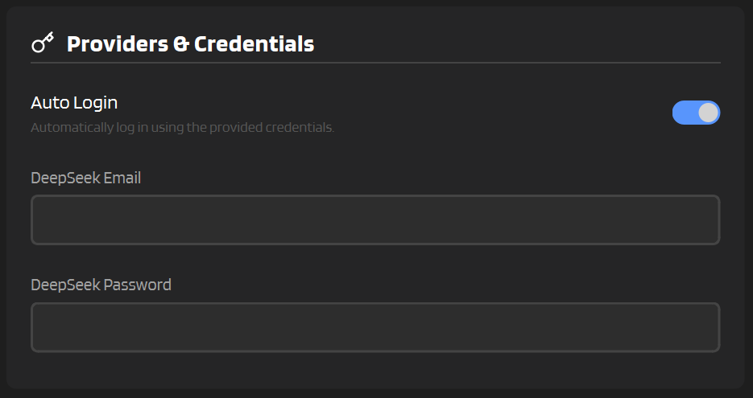

# :material-key: Login & Sessions

Managing how you log in to your active provider (DeepSeek / GLM Chat / Moonshot) and keeping your session alive between restarts. These two features work together to make your life easier.

---

## :material-login: Auto Login

If you're tired of typing your password every time, Auto Login saves your provider credentials and enters them automatically when the browser opens (DeepSeek / GLM Chat).



### Setting It Up

1. Go to **Settings** → **Providers & Credentials**
2. Select your **Provider**
3. Toggle on **Auto Login**
4. Enter the email/password for your provider (used by DeepSeek / GLM Chat auto-login)
5. Click **Save**

Next time you start IntenseRP, DeepSeek / GLM Chat can fill credentials and click login for you.

!!! tip "Using ECE (Experimental Credential Engine)?"
    If you enabled **ECE**, the legacy provider email/password fields are hidden. Instead, use:
    
    :material-arrow-right: **Settings** → **Providers & Credentials** → **Credential Manager**
    
    See [:material-key: ECE](../experimental/ece.md) for how selection and rotation works.

!!! warning "GLM CAPTCHA"
    GLM Chat requires a CAPTCHA during login. Auto Login can fill your credentials, but you still need to solve the CAPTCHA in the browser window.
    If you don't want to do that every time, enable Persistent Sessions (below).

!!! note "Moonshot login"
    Moonshot uses a manual Google login flow in IntenseRP.
    Auto Login does not submit Moonshot credentials.
    Depending on your account security settings, manual confirmation/challenge steps can still be required.

### How It Works

When IntenseRP detects you've been redirected to the provider sign-in page (DeepSeek / GLM Chat):

1. It waits for the login form to appear
2. Fills in your email and password
3. Clicks the login button
4. Waits for the redirect back to the chat page

If anything goes wrong (wrong password, captcha, etc.), you'll see an error in the console and can log in manually.

!!! note "Manual Login"
    If Auto Login is disabled, IntenseRP just waits patiently :service_dog: for you to log in yourself. Take your time - it won't time out.

---

## :material-cookie: Persistent Sessions

This one's even better. Instead of logging in every time (even automatically), Persistent Sessions saves your browser profile so you stay logged in between restarts.

### How It Works

When enabled, IntenseRP uses a "persistent browser context" - basically saving cookies, local storage, and session data to a folder on your computer. Next time you start the app, it loads that profile and you're already logged in.

:material-arrow-right: **Settings** → **System Settings** → **Persistent Sessions**

### Where's the Data Stored?

The browser profile is saved in your config directory (one folder per provider):

```
[config_dir]/playwright_profiles/deepseek/
[config_dir]/playwright_profiles/glm_chat/
[config_dir]/playwright_profiles/moonshot_kimi/
```

IntenseRP uses the folder for the currently selected **Provider**.

This folder contains your provider session cookies and browser data. It's automatically created when you first enable Persistent Sessions.

!!! note "ECE changes the profile paths"
    If you enable **ECE**, Persistent Sessions are stored under:
    
    ```
    [config_dir]/playwright_profiles/ece/deepseek/<hash>/
    [config_dir]/playwright_profiles/ece/glm_chat/<hash>/
    [config_dir]/playwright_profiles/ece/moonshot_kimi/<hash>/
    ```
    
    Each account gets its own hashed folder name, so sessions don't mix.

!!! tip "GLM recommendation"
    Persistent Sessions are strongly recommended for GLM Chat, because login requires a CAPTCHA.

!!! tip "Best of Both Worlds"
    You can use both features together! Enable Persistent Sessions so you're usually already logged in, and keep Auto Login as a backup for when the session expires (especially on DeepSeek / GLM Chat).

---

## :material-delete: Deleting Profiles

If you want to start fresh or log out completely, you can delete a specific saved browser profile (or wipe them all):

- **Delete Profile**: :material-arrow-right: **Settings** → **System Settings** → **Delete Profile** (pick one, click **Delete**)
- **Clear All Profiles**: :material-arrow-right: **Settings** → **System Settings** → **Clear All Profiles**

Deleting a profile folder:

- Removes all cookies and session data
- Logs you out (of that provider, or all providers if you clear all)
- Forces a fresh login next time

!!! warning "This Can't Be Undone"
    Once deleted, you'll need to log in again. If you have Auto Login enabled, this happens automatically. Otherwise, you'll log in manually.

---

## :material-frequently-asked-questions: Quick FAQ

??? question "Do I need both Auto Login and Persistent Sessions?"
    Nope! You can use either one:
    
    - **Just Auto Login**: Logs in fresh every time (slower, but always works)
    - **Just Persistent Sessions**: Stays logged in until the session expires
    - **Both**: Best reliability - persistent session when it works, auto login as fallback

    For Moonshot, login is manual Google flow. Persistent Sessions still help reduce repeated manual logins.

??? question "My session keeps expiring?"
    Provider sessions do expire eventually. If Persistent Sessions isn't keeping you logged in long enough, make sure you also have Auto Login configured as a backup.

??? question "Is my password stored securely?"
    Your credentials are saved in the config file on your local machine. IntenseRP doesn't send them anywhere except to provider login flows that support credential autofill. If you're concerned, you can skip Auto Login and log in manually each time.

??? question "Can I use this with multiple accounts?"
    Yes. Use **ECE (Experimental Credential Engine)** to store multiple credential pairs per provider and rotate between them.
    See [:material-key: ECE](../experimental/ece.md).

---

## :material-arrow-left: Back to Features

[:material-arrow-left: Features Overview](../features.md)
