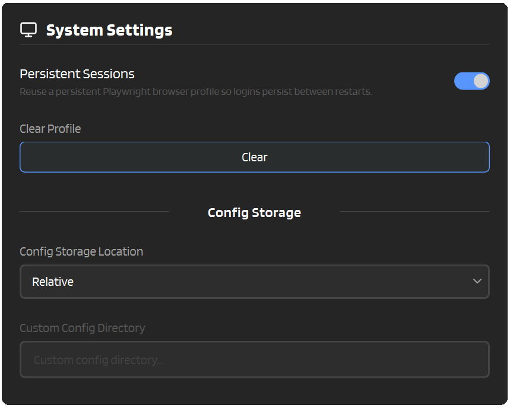
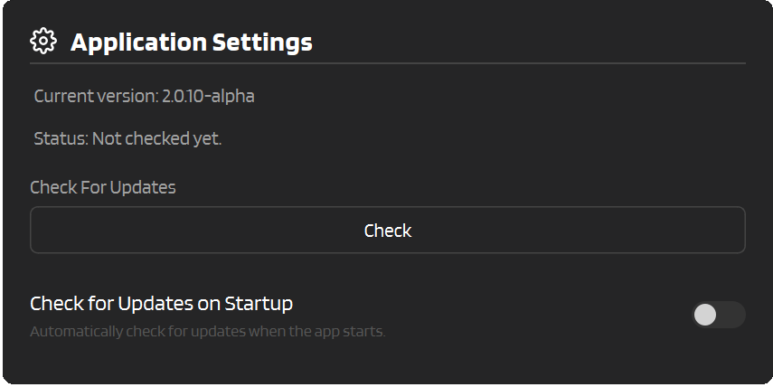

# :material-cog: System

This page covers the "maintenance" side of IntenseRP Next v2: where settings live, how to move/backup them, session/profile management, and how updates work.

---

## :material-cog-outline: Where to Find These Settings

Most of the system-related settings are in two places throughout the Settings window:

- :material-arrow-right: **Settings** → **System Settings** (profiles + config storage)
- :material-arrow-right: **Settings** → **Application Settings** (version + updates)



---

## :material-cookie: Persistent Sessions

Persistent Sessions keeps you logged in between restarts by storing a reusable Playwright browser profile (cookies, local storage, etc.).

:material-arrow-right: **Settings** → **System Settings** → **Persistent Sessions**

### How It Works

When enabled, IntenseRP launches Chromium using a **persistent browser context**. The profile is stored inside your config directory:

```
[config_dir]/playwright_profiles/deepseek/
```

Next time you start the app, it loads that same profile, so you usually won’t see a login page at all.

!!! tip "Best Reliability"
    Keep **Auto Login** enabled as a fallback. If your session expires, Persistent Sessions won’t help, but Auto Login will still sign you in automatically.

---

## :material-delete: Clear Profile

If the saved session gets weird (stuck login, expired cookies, endless redirects), Clear Profile deletes the saved DeepSeek browser profile so you can start fresh.

:material-arrow-right: **Settings** → **System Settings** → **Clear Profile**

What this does:

- Deletes `[config_dir]/playwright_profiles/deepseek/`
- Logs you out of DeepSeek (cookies/local storage are removed)
- Forces a fresh login on next start

!!! warning "This can’t be undone"
    Clearing the profile wipes the saved session data. If you don’t have Auto Login enabled, you’ll need to log in manually next time.

---

## :material-folder-cog: Where Settings Live

IntenseRP stores all the important local stuff in a single **config directory**, including:

- `settings.json.enc` - your settings (encrypted at rest)
- `settings.key` - the encryption key used to read/write settings
- `playwright_profiles/` - browser profiles (Persistent Sessions)

### What is `[config_dir]` exactly?

`[config_dir]` is whatever directory IntenseRP is currently using as its config root. You can change it via **Config Storage Location** (below).

If you want to see the exact active path on disk:

1. Open the folder where the app executable is located
2. Find `config_dir.txt`
3. Open it with Notepad / any text editor

That file contains the active config directory path.

!!! note "Security Reality Check"
    The settings file is encrypted, but the key (`settings.key`) lives right next to it. This protects against casual snooping, but it’s not meant as strong protection if someone has access to your files. Treat your config directory as sensitive.

---

## :material-database-cog: Config Storage Location Presets

:material-arrow-right: **Settings** → **System Settings** → **Config Storage Location**

This dropdown controls where IntenseRP stores `config_data` (settings, keys, profiles).

| Preset | Typical path | Best for |
|---|---|---|
| **Relative** | Next to the app (`<app-folder>/config_data/`) | Portable installs, USB drives, keep everything in one folder |
| **Windows AppData** | `%APPDATA%\\IntenseRP Next\\config_data\\` | Standard Windows installs, backups via user profile |
| **Linux User Data** | `$XDG_DATA_HOME/IntenseRP Next/config_data/` (or `~/.local/share/...`) | Standard Linux installs |
| **Custom** | You choose | Advanced layouts (separate drive, synced folder, etc.) |

!!! info "OS-specific options"
    You’ll only see **Windows AppData** on Windows, and **Linux User Data** on Linux.

---

## :material-truck-fast: Migrating Config Storage

Changing config storage is a little more involved, because IntenseRP needs to move your existing settings/profile to the new location, but luckily it can do that for you automatically.

### Steps

1. Go to **Settings** → **System Settings**
2. Under **Config Storage**, choose a new **Config Storage Location**
3. If you pick **Custom**, set **Custom Config Directory**
4. Click **Save**
5. Confirm the migration prompt

After a successful migration, IntenseRP restarts automatically.

### Important safety behavior

During migration, IntenseRP will:

- Copy the entire current config directory to the new location
- Refuse "dangerous" targets (overlapping folders, filesystem roots, app folder, etc.)
- Refuse non-empty target folders that don’t look like an IntenseRP config directory
- Replace the destination contents when it’s allowed to proceed

!!! warning "Pick a dedicated folder"
    If you use **Custom**, point it to an empty folder (or a folder that already contains an IntenseRP config). Don’t point it at "Documents", "Desktop", or any folder with unrelated files.

---

## :material-content-save: Backup & Restore

!!! note "Work in Progress"
    Backup and restore instructions are preliminary as of this writing. A more user-friendly backup/restore feature are in the works.

### Back up your settings

1. Close IntenseRP
2. Copy your entire `[config_dir]/` somewhere safe

That backup includes your settings, API keys, and (if enabled) your persistent browser profile.

### Restore from a backup

1. Close IntenseRP
2. Put the backed-up folder back as your config directory
3. Either:
   - Set **Config Storage Location** to point to it (recommended), or
   - Update `config_dir.txt` to the restored path (advanced)

!!! tip "Portable Backups"
    If you use **Relative**, you can usually back up by copying the whole app folder. `config_data/` lives inside it.

---

## :material-update: Updates

:material-arrow-right: **Settings** → **Application Settings**



### How the update check works

When you check for updates, IntenseRP downloads the latest `version.txt` from GitHub and compares it to your local `version.txt` (SemVer-style comparison).

!!! note "Requires internet access"
    If GitHub is blocked (network restrictions, firewall, captive portal), update checks will fail.

### If an update is available

You’ll get an "Update Available" dialog and can choose a method based on how you installed the app:

- **Auto-Update** - available only in packaged builds on Windows/Linux
- **Git** - available only when running from source (a git checkout)

=== ":material-download: Auto-Update"

    - Downloads the release archive
    - Stages an update payload
    - Runs a small updater and restarts the app

    !!! warning "Not available on source runs"
        If you’re running `python main.py`, Auto-Update is disabled.

=== ":material-git: Git"

    Close the app, then update from your repo folder:

    ```bash
    git pull
    # NOTE: If you use a virtual environment, activate it first
    source venv/bin/activate
    # END NOTE
    pip install -r requirements.txt
    python main.py
    ```

    !!! warning "Not available in the .exe/.zip build"
        Packaged builds don’t include a git checkout, so Git updating is disabled there.

---

## :material-bug: Troubleshooting

??? question "Persistent Sessions is enabled, but I still get logged out"
    DeepSeek sessions can expire. If it happens frequently:

    - Enable **Auto Login** as a fallback (Providers & Credentials)
    - Use **Clear Profile** if the stored profile is corrupted or stuck

??? question "Config migration failed / was refused"
    Common reasons:

    - The target folder is not empty and doesn’t look like an IntenseRP config directory
    - The target is a filesystem root (e.g. `C:\\`, `/`)
    - The target overlaps the current config directory
    - The target contains (or is) the app folder

    Fix:

    - Choose a new empty folder for **Custom**
    - Or choose **Relative / AppData / Linux User Data**

??? question "After changing Config Storage Location, my settings look reset"
    That usually means IntenseRP is now pointing at a *new* (empty) config directory.

    - Check `config_dir.txt` to confirm the active path
    - Switch back to the previous config storage location
    - Or restore your backup into the active `[config_dir]`

??? question "Update checks always fail"
    - Make sure you have internet access
    - Check that GitHub isn’t blocked by your network/firewall
    - Try again later (GitHub can rate-limit or temporarily error)

---

## :material-format-list-checks: Quick Reference

| Item | Where it lives |
|---|---|
| Active config directory pointer | `<app-folder>/config_dir.txt` |
| Encrypted settings file | `[config_dir]/settings.json.enc` |
| Settings encryption key | `[config_dir]/settings.key` |
| Persistent browser profile | `[config_dir]/playwright_profiles/deepseek/` |

---

## :material-arrow-left: Back to Features

[:material-arrow-left: Features Overview](../features.md)
