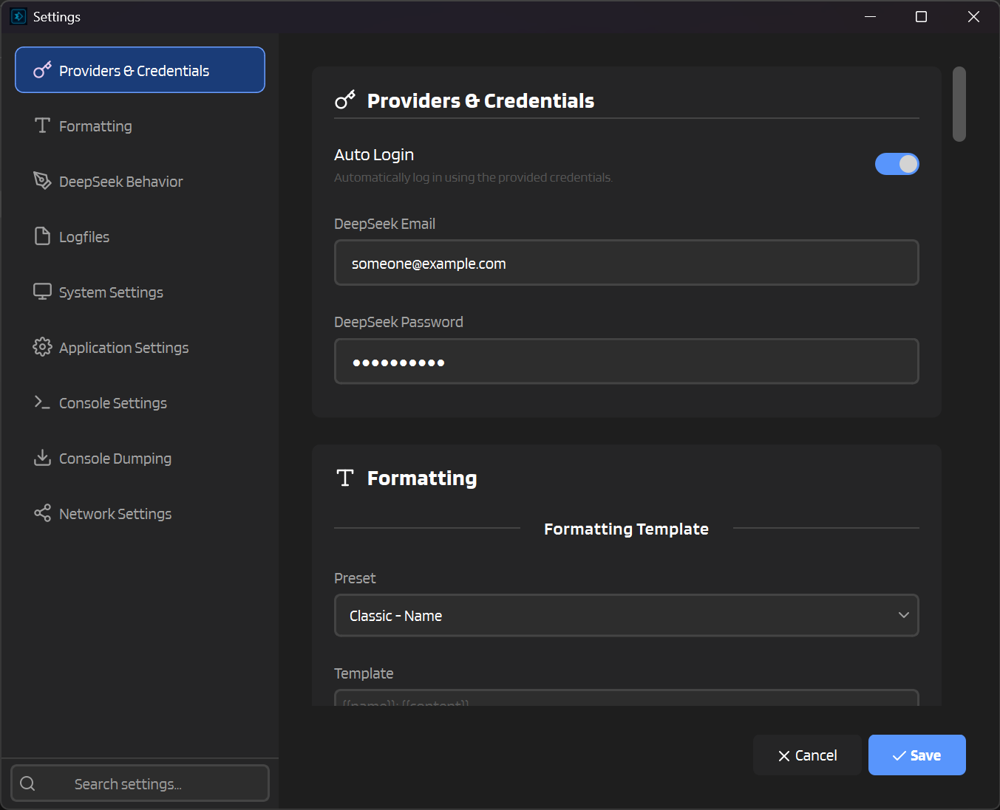

# :material-rocket-launch: Getting Started

Let's get you up and running with IntenseRP Next v2! This guide covers everything from installation to chatting in SillyTavern.

---

## :material-clipboard-check-outline: What You'll Need

Before we dive in, make sure you have:

| | |
|---|---|
| :material-microsoft-windows: **Windows 10/11** or :material-linux: **Linux** | 64-bit with a graphical desktop |
| :material-account-plus: **DeepSeek, GLM, or Moonshot account** | [DeepSeek](https://chat.deepseek.com), [GLM Chat (Z.ai)](https://chat.z.ai/), or [Kimi](https://www.kimi.com/) |
| :material-chat: **SillyTavern** (or similar) | Any OpenAI-compatible client works |

---

## :material-download: Step 1: Download & Install

Pick your platform and let's go!

=== ":material-microsoft-windows: Windows"

    1. Head to the [:material-github: Releases page](https://github.com/LyubomirT/intense-rp-next/releases)
    2. Grab the latest **`intenserp-next-v2-win32-x64.zip`**
    3. Extract it somewhere you'll remember
    4. Open the `intense-rp-next` folder and run **`intenserp-next-v2.exe`**
    
    
    
    !!! tip "First Time?"
        The app will download browser components on first launch. Give it a minute!

=== ":material-linux: Linux"

    1. Head to the [:material-github: Releases page](https://github.com/LyubomirT/intense-rp-next/releases)
    2. Grab the latest **`intenserp-next-v2-linux-x64.tar.gz`**
    3. Extract and run:
    
    ```bash
    tar -xzf intenserp-next-v2-linux-x64.tar.gz
    cd intense-rp-next
    chmod +x intenserp-next-v2
    ./intenserp-next-v2
    ```
    
    !!! warning "Missing Libraries?"
        This sometimes happens, especially if you don't install new software often. You might need to install Qt6 dependencies. The most common ones are: `libxcb-cursor0`, `libegl1`, `libxkbcommon0`.

=== ":material-git: From Source"

    For developers or those who like living on the edge:
    
    ```bash
    git clone https://github.com/LyubomirT/intense-rp-next.git
    cd intense-rp-next
    
    # Create a virtual environment (recommended)
    python -m venv venv

    source venv/bin/activate  # Linux/Mac
    # or: venv\Scripts\activate  # Windows
    
    # Install deps
    pip install -r requirements.txt

    # Optional, since IntenseRP can auto-download browsers
    playwright install chromium
    
    # Run it!
    python main.py
    ```
    
    !!! note "Python 3.12+"
        Make sure you're running Python 3.12 or newer.

---

## :material-cog: Step 2: Set Up Your Credentials

Before hitting Start, pick your provider and (optionally) save your login so you don't have to type it every time.

1. Click the :material-cog: **Settings** button
2. Go to **Providers & Credentials**
3. Choose your **Provider** (DeepSeek, GLM Chat, or Moonshot)
4. (Optional) Turn on :material-toggle-switch: **Auto Login** (DeepSeek / GLM Chat)
5. Enter your provider **email** and **password** (used for DeepSeek / GLM auto-login)
6. Hit :material-content-save: **Save**



!!! info "Skip This?"
    If you prefer to log in manually each time, just skip this step. The browser will pop up a login page instead.

!!! warning "GLM CAPTCHA"
    GLM Chat requires a CAPTCHA during login. Auto Login can fill your credentials, but you still need to solve the CAPTCHA in the browser window.
    Persistent Sessions are strongly recommended if you do not want to solve it every start.

!!! note "Moonshot login"
    Moonshot uses a manual Google login flow in IntenseRP (no credential autofill step). Depending on your account security settings, manual confirmation/challenge steps may still be required.

---

## :material-play-circle: Step 3: Start the Server

Alright, the fun part!

1. Click the big :material-play: **Start** button
2. A browser window will pop up
3. DeepSeek / GLM Chat can use auto-login. Moonshot requires manual Google login in the browser window.
4. Once logged in, the status changes to :material-check-circle: **Running (Port 7777)**

<div class="image-grid" markdown>


</div>

!!! success "You're Live!"
    IntenseRP is now running and ready to accept requests.

---

## :material-power-plug: Step 4: Connect SillyTavern

Now let's hook up SillyTavern to use IntenseRP as its backend.

### :material-numeric-1-circle: Open API Connections

Click the :material-power-plug: **API** button in SillyTavern's top bar.


### :material-numeric-2-circle: Pick the Right Settings

| Setting | What to Choose |
|---------|---------------|
| **API Type** | :material-chat-processing: Chat Completion |
| **Chat Completion Source** | :material-tune: Custom (OpenAI-compatible) |

### :material-numeric-3-circle: Enter the Endpoint

| Field | Value |
|-------|-------|
| :material-web: **Custom Endpoint** | `http://127.0.0.1:7777/v1` |
| :material-key: **API Key** | Leave blank |
| :material-robot: **Model** | `deepseek-*` / `glm-*` / `moonshot-*` |

!!! note
    Use the model ID that matches your active provider:

    - DeepSeek -> `deepseek-auto`
    - GLM Chat -> `glm-auto`
    - Moonshot -> `moonshot-auto`

!!! info "Model Names"
    The model IDs are behavior presets (modes). Which set you get depends on your active provider.

    === ":material-brain: DeepSeek"

        - `deepseek-auto` (default, respects your IntenseRP settings)
        - `deepseek-chat` (reasoning always off)
        - `deepseek-reasoner` (reasoning always on, respects `Send DeepThink` setting)

    === ":material-chat-processing: GLM Chat"

        - `glm-auto` (default, respects your IntenseRP settings)
        - `glm-chat` (Deep Think always off)
        - `glm-reasoner` (Deep Think always on, respects `Send Deep Think` setting)

        !!! note "GLM model selection"
            The `glm-*` IDs are still modes (behavior presets).

            The *real* GLM model is selected in IntenseRP:

            :material-arrow-right: **Settings** -> **GLM Behavior** -> **Model** (GLM-5, GLM-4.7, or GLM-4.6)

            GLM-4.6v exists, but IntenseRP intentionally does not select it.

    === ":material-meteor: Moonshot"

        - `moonshot-auto` (default, respects your IntenseRP settings)
        - `moonshot-chat` (forces Thinking off and Send Thinking off)
        - `moonshot-reasoner` (forces Thinking on, respects `Send Thinking` setting)

        !!! note "Moonshot model IDs"
            `moonshot-*` IDs are behavior presets (modes), not a separate backend model selector.
            Thinking/Search behavior still comes from **Moonshot Behavior** settings, with these mode overrides.


### :material-numeric-4-circle: Connect!

Click :material-connection: **Connect** and look for the green indicator.

!!! success ":material-party-popper: You Did It!"
    Start a chat and enjoy free LLM completions!

---

## :material-tune-vertical: Extra Settings (Optional)

Here are some handy tweaks you might want to know about.

### :material-tag-multiple: Set up Names

So that IntenseRP knows the names of your characters and personas, you'll want to set up a way to send names to it.

The recommended way is to set **Character Names Behavior** to **Completion Object**. This automatically sends character names to the API with every message, so IntenseRP can use them in formatting and injections.


---

### :material-lan: Change the Port

By default IntenseRP listens on port `7777`. If that happens to be taken, you can change it:

:material-arrow-right: **Settings** → **Network Settings** → **Port**

Don't forget to update your SillyTavern endpoint too!

---

### :material-brain: Enable DeepThink

And just as before, we support provider reasoning features. In simple words, it makes the model "smarter" by letting it think through problems step-by-step before answering (but also makes it slower and can change the tone).

:material-arrow-right: **Settings** → **DeepSeek Behavior** (or GLM/Moonshot Behavior, depending on your provider)

| Option | What It Does |
|--------|-------------|
| :material-toggle-switch: **Enable DeepThink** | Turns on the thinking toggle in DeepSeek |
| :material-toggle-switch: **Send DeepThink** | Includes reasoning in responses |

---

### :material-cookie: Persistent Sessions

Tired of logging in every time you restart?

:material-arrow-right: **Settings** → **System Settings** → :material-toggle-switch: **Persistent Sessions**

This saves your browser session so you stay logged in (unless you log out manually).

---

## :material-help-circle: Troubleshooting

!!! tip "Need more?"
    See [:material-bug: Troubleshooting](hands/troubleshooting.md) for a full checklist and bug report tips.

### :material-window-close: Browser Won't Open

- Make sure you have enough disk space (~500MB for browser, ~300MB for the app)
- Check if your antivirus is blocking the app
- Try restarting the app

### :material-connection: SillyTavern Can't Connect

- Is IntenseRP showing **Running**? If not, click Start
- Double-check the port matches (default: `7777`)
- Make sure you're using `http://`, not `https://`

### :material-alert: "Sorry, that's beyond my current scope"

That's DeepSeek's content filter kicking in. To hide this message:

:material-arrow-right: **Settings** → **DeepSeek Behavior** → :material-toggle-switch: **Anti-Censorship**

!!! note
    This doesn't bypass the filter; we just "snatch" the message before it's censored.

---

## :material-arrow-right-bold: What's Next?

<div class="grid cards" markdown>

-   :material-star-four-points: **Explore Features**

    Learn about formatting templates, injections, and more.

    [:material-arrow-right: Features](features.md)

-   :material-transfer: **Migration Guide**

    Coming from IntenseRP v1? See what changed.

    [:material-arrow-right: Migrate](migration.md)

</div>
