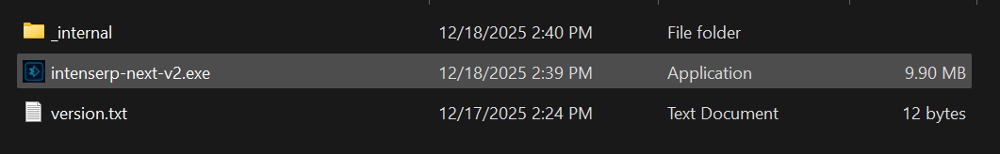
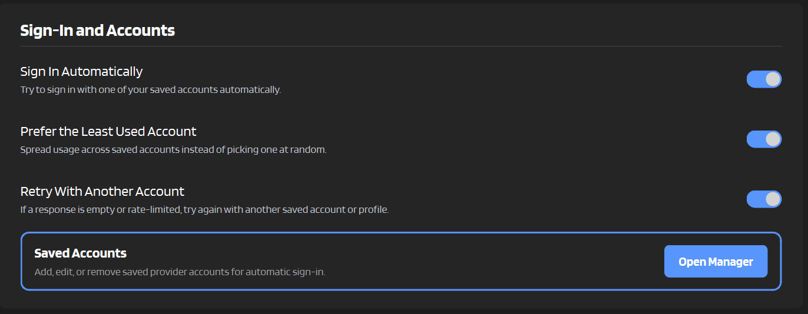
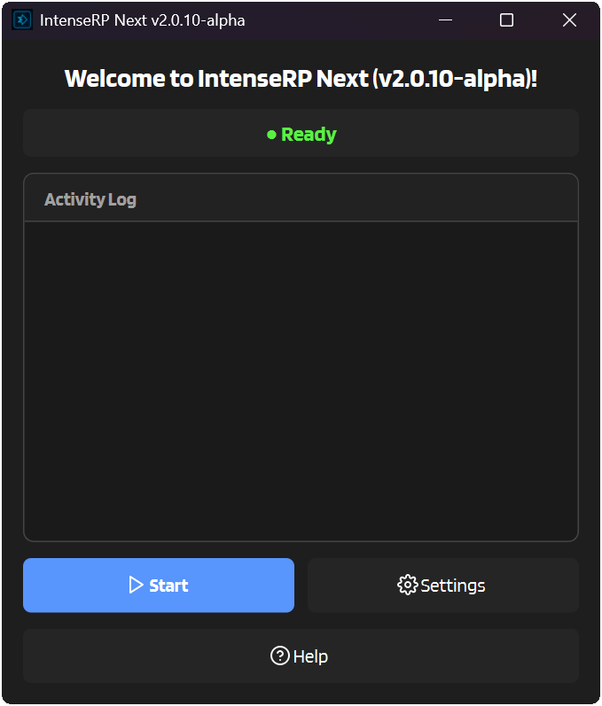
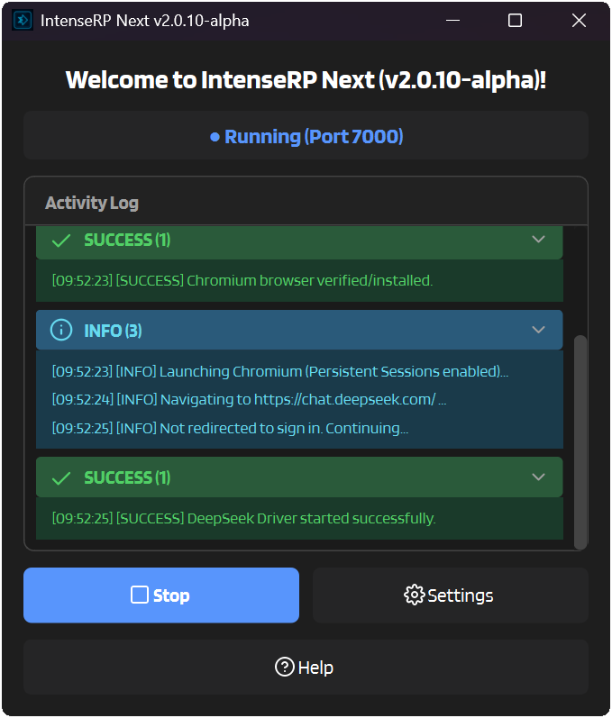
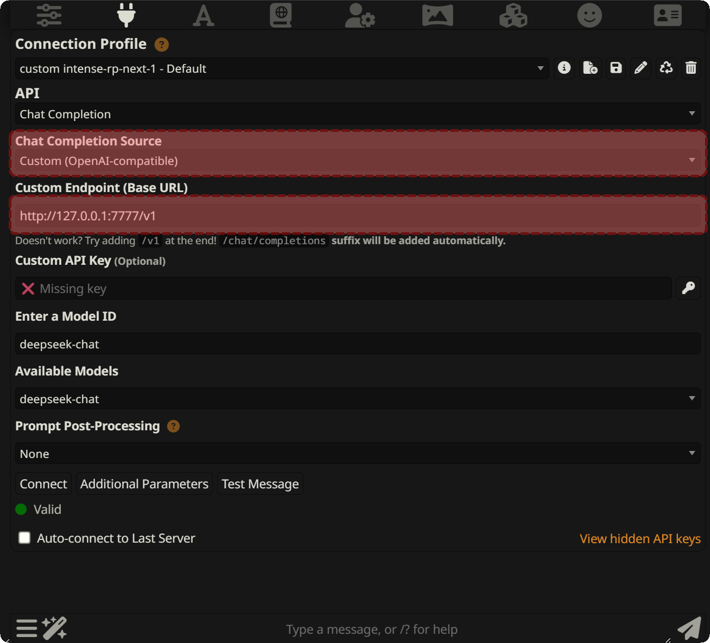
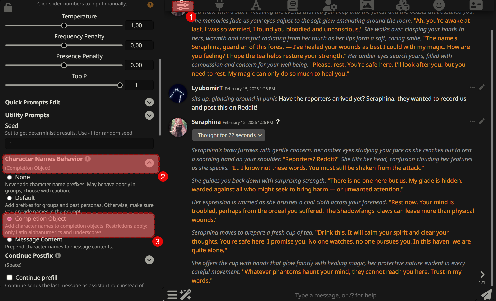

# :material-rocket-launch: Getting Started

Let's get IntenseRP installed, connected to a provider, and talking to SillyTavern. This page sticks to the setup path, while deeper provider weirdness gets linke out to the relevant Behavior pages in :material-cloud: [Providers](providers.md).

---

## :material-clipboard-check-outline: What You'll Need

Before we dive in, make sure you have:

| | |
|---|---|
| :material-microsoft-windows: **Windows 10/11** or :material-linux: **Linux** | 64-bit with a graphical desktop |
| :material-account-plus: **Provider account** | [DeepSeek](https://chat.deepseek.com), [GLM Chat (Z.ai)](https://chat.z.ai/), [Kimi](https://www.kimi.com/), [QwenLM](https://chat.qwen.ai/), [Perplexity](https://www.perplexity.ai/), or [HuggingChat](https://huggingface.co/chat). [Google AI Studio](https://aistudio.google.com/) is temporarily locked by default. |
| :material-chat: **SillyTavern** (or similar) | Any OpenAI-compatible client works |

---

## :material-download: Step 1: Download & Install

Pick your platform and let's go!

=== ":material-microsoft-windows: Windows"

    1. Head to the [:material-github: Releases page](https://github.com/LyubomirT/intense-rp-next/releases)
    2. Grab the latest **`intenserp-next-v2-win32-x64.zip`**
    3. Extract it somewhere you'll remember
    4. Open the `intense-rp-next` folder and run **`intenserp-next-v2.exe`**
    
    
    
    !!! tip "First Time?"
        The app will download browser components on first launch. Give it a minute!

=== ":material-linux: Linux"

    1. Head to the [:material-github: Releases page](https://github.com/LyubomirT/intense-rp-next/releases)
    2. Grab the latest **`intenserp-next-v2-linux-x64.tar.gz`**
    3. Extract and run:
    
    ```bash
    tar -xzf intenserp-next-v2-linux-x64.tar.gz
    cd intense-rp-next
    chmod +x intenserp-next-v2
    ./intenserp-next-v2
    ```
    
    !!! warning "Missing Libraries?"
        This sometimes happens, especially if you don't install new software often. You might need to install Qt6 dependencies. The most common ones are: `libxcb-cursor0`, `libegl1`, `libxkbcommon0`.

=== ":material-git: From Source"

    For developers or those who like living on the edge:
    
    ```bash
    git clone https://github.com/LyubomirT/intense-rp-next.git
    cd intense-rp-next
    
    # Create a virtual environment (recommended)
    python -m venv venv

    source venv/bin/activate  # Linux/Mac
    # or: venv\Scripts\activate  # Windows
    
    # Install deps
    pip install -r requirements.txt

    # Optional, since IntenseRP can auto-download browsers
    playwright install chromium
    
    # Run it!
    python main.py
    ```
    
    !!! note "Python 3.12+"
        Make sure you're running Python 3.12 or newer.

---

## :material-cog: Step 2: Provider + Account

Before hitting **Start**, pick your provider and decide whether IntenseRP should try to sign in for you.

1. Click the :material-cog: **Settings** button
2. Go to **Provider and Login**
3. In **Current Provider**, choose your provider (DeepSeek, GLM Chat, Moonshot, QwenLM, Perplexity, or HuggingChat)
4. In **Sign-In and Accounts**, (optional) turn on :material-toggle-switch: **Sign In Automatically**
5. Open **Saved Accounts** and add your account(s)
6. (Optional) Enable **Prefer the Least Used Account** and/or **Retry With Another Account**
7. Hit :material-content-save: **Save**

<!-- TODO: replace with an updated screenshot -->


!!! tip "Manual login is fine"
    You don't have to save credentials if you don't want to. If **Sign In Automatically** is off, IntenseRP opens the provider browser and waits for you to log in yourself.

!!! note "Provider login quirks"
    Some providers still need a human even with Auto Login enabled:

    | Provider | What to expect |
    |---|---|
    | **GLM Chat** | Auto Login can fill credentials, but you still solve the CAPTCHA. Persistent sessions help a lot. |
    | **Moonshot / Google AI Studio** | Google sign-in may ask for confirmation, 2FA, or manual popup cleanup. |
    | **Perplexity** | Auto Login starts the email-code flow, but you enter the 6-digit code. |
    | **HuggingChat** | Uses Hugging Face credentials; free monthly credits can run out quickly on heavier models. |

    For the longer version, see [:material-key: Login & Sessions](features/login-sessions.md) and [:material-cloud: Providers](providers.md).

!!! warning "Google AI Studio is temporarily locked"
    AI Studio currently appears to detect Patchright/automated browser sessions and can block automated sends. You can still configure it under **Provider Behavior**, but it only appears as a selectable provider if you enable **Settings** -> **Advanced** -> **Provider Stability** -> **Ignore Provider Locks**.

!!! note "Upgrading?"
    If you previously saved credentials in older versions, IntenseRP imports them into **Saved Accounts** on startup.

---

## :material-play-circle: Step 3: Start the Server

Alright, the fun part!

1. Click the big :material-play: **Start** button
2. A browser window will pop up
3. All normally selectable providers can use auto-login, though Moonshot and Perplexity may still need manual confirmation in the browser.
4. Once logged in, the status changes to :material-check-circle: **Running (Port 7777)**

<div class="image-grid" markdown>





</div>

!!! success "You're Live!"
    IntenseRP is now running and ready to accept requests.

---

## :material-power-plug: Step 4: Connect SillyTavern

Now let's hook up SillyTavern to use IntenseRP as its backend.

### :material-numeric-1-circle: Open API Connections

Click the :material-power-plug: **API** button in SillyTavern's top bar.


### :material-numeric-2-circle: Pick the Right Settings

| Setting | What to Choose |
|---------|---------------|
| **API Type** | :material-chat-processing: Chat Completion |
| **Chat Completion Source** | :material-tune: Custom (OpenAI-compatible) |

### :material-numeric-3-circle: Enter the Endpoint

| Field | Value |
|-------|-------|
| :material-web: **Custom Endpoint** | `http://127.0.0.1:7777/v1` |
| :material-key: **API Key** | Leave blank |
| :material-robot: **Model** | `deepseek-*` / `glm-*` / `moonshot-*` / `qwen-*` / `perplexity-*` / `huggingchat-*` |

!!! note
    Use the model ID that matches your active provider:

    - DeepSeek -> `deepseek-auto`
    - GLM Chat -> `glm-auto`
    - Moonshot -> `moonshot-auto`
    - QwenLM -> `qwen-auto`
    - Perplexity -> `perplexity-auto`
    - HuggingChat -> `huggingchat-auto`
    - Google AI Studio -> `aistudio-auto` only when **Ignore Provider Locks** is enabled

!!! info "Model IDs"
    The `*-auto` model is the default and respects your IntenseRP settings for the active provider.

    There are also `*-chat` and `*-reasoner` variants.
    For the full list, see [:material-lan: Network & API](features/network-api.md).



### :material-numeric-4-circle: Connect!

Click :material-connection: **Connect** and look for the green indicator.

!!! success ":material-party-popper: You Did It!"
    Start a chat and enjoy free LLM completions!

---

## :material-tune-vertical: Useful First Tweaks

You can ignore these on the first launch, but they are worth knowing about once the basic connection works.

### :material-tag-multiple: Set up Names

If you want IntenseRP to format messages with the right character and persona names, set SillyTavern to send names in the request.

The recommended way is to set **Character Names Behavior** to **Completion Object**. This automatically sends character names to the API with every message, so IntenseRP can use them in formatting and injections.



---

### :material-lan: Change the Port

By default IntenseRP listens on port `7777`. If that happens to be taken, you can change it:

:material-arrow-right: **Settings** → **API Server** → **Access** → **Server Port**

Don't forget to update your SillyTavern endpoint too!

---

### :material-cookie: Persistent Sessions

Tired of logging in every time you restart?

:material-arrow-right: **Settings** → **Provider and Login** → **Saved Sessions** → :material-toggle-switch: **Keep Provider Sessions Signed In**

This saves your browser session so you stay logged in unless the provider expires the session or you log out manually.

---

### :material-brain: Reasoning / Thinking

Most providers have some version of reasoning mode. DeepSeek calls it **DeepThink**, GLM calls it **Deep Think**, and others use names like **Thinking** or **Thinking Effort**.

:material-arrow-right: **Settings** → **Provider Behavior** → pick your provider in the selector

The `*-auto` model IDs respect your provider settings. Where supported, `*-reasoner` forces reasoning on and `*-chat` forces it off. See [:material-cloud: Providers](providers.md) for the exact behavior per provider.

---

## :material-help-circle: Troubleshooting

If something fails during setup, check these first:

| Problem | Quick check |
|---|---|
| Browser doesn't open | Restart IntenseRP, check antivirus/firewall blocks, and make sure there is enough disk space for the browser install. |
| SillyTavern can't connect | IntenseRP should show **Running**, the endpoint should use `http://`, and the port should match. Default: `http://127.0.0.1:7777/v1`. |
| Login gets stuck | Try manual login once, then enable **Keep Provider Sessions Signed In** after the provider accepts the session. |
| Provider refuses or blocks a reply | Check that provider's Behavior page; some providers have optional mitigation settings. |

!!! tip "Need more?"
    See [:material-bug: Troubleshooting](hands/troubleshooting.md) for the full checklist and bug report tips.

---

## :material-arrow-right-bold: What's Next?

<div class="grid cards" markdown>

-   :material-star-four-points: **Explore Features**

    Learn about formatting templates, injections, and more.

    [:material-arrow-right: Features](features.md)

-   :material-transfer: **Migration Guide**

    Coming from IntenseRP v1? See what changed.

    [:material-arrow-right: Migrate](migration.md)

</div>
