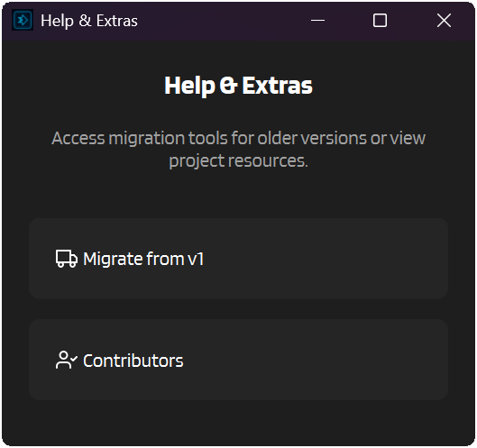

# :material-transfer: Migration Guide

This page helps you move from:

- **IntenseRP Next v1** (by LyubomirT)
- **IntenseRP API** (by Omega-Slender)

The features are mostly the same, but v2 is a full rewrite with a different structure, config layout, and formatting system. The goal is to get you running on v2 quickly, without losing important behavior.

!!! warning "Manual review is mandatory"
    Even if migration succeeds, you must manually review your settings (especially Formatting and Injection). v1 used a different placeholder and template structure, and v2 is more standardized.

---

## :material-clipboard-check-outline: Before You Start

- Close your old IntenseRP app (v1 / API) so its config files are not being written while you migrate.
- Keep a backup of your old install folder. The migrator does not delete it, but you should still keep a copy.
- Install and run v2 at least once so it creates its v2 config directory.

!!! note "Where v2 stores settings"
    v2 stores settings under its config directory (see `config_dir.txt` next to the app executable). The important files are:

    - `[config_dir]/settings.json.enc`
    - `[config_dir]/settings.key`

---

## :material-truck-fast: Migrating From IntenseRP Next v1

v2 includes a built-in **v1 settings migrator**. It reads your v1 encrypted config, maps known settings to v2, and saves them into v2.

!!! info "v1 version requirement"
    The built-in migrator expects an IntenseRP Next v1 install that uses the `save/config.enc` + `save/secret.key` format (v1.5.3+).

### Step-by-step

1. Open v2
2. Click **Help**
3. Click **Migrate from v1**
4. Select your **v1 installation root folder**

The folder you select must contain:

```
<your-v1-folder>/save/config.enc
<your-v1-folder>/save/secret.key
```

Optional (if you used a custom formatting template in v1):

```
<your-v1-folder>/save/custom_user_template.enc
<your-v1-folder>/save/custom_char_template.enc
```

!!! note "No 'save' folder"
    Do not select the `save` folder itself. Select the parent folder that contains `save`.



---

## :material-download-box: What The v1 Migrator Copies (And What It Doesn't)

The migrator is best-effort. It migrates the common stuff, but there are important differences you must review manually.

### Migrated automatically (best-effort)

- **Providers & Credentials**: Auto Login, DeepSeek email, DeepSeek password
- **DeepSeek Behavior**: DeepThink, Send DeepThink, Search, Send As Text File, Clean Regeneration
- **Formatting**:
    - Preset mapping (v1 preset names -> v2 preset names)
    - Attempts to import your **custom template** if you used Custom
    - Imports v1 Injection "system prompt" as v2 Injection content
- **Network**: Port and API keys (if configured)
- **Logging**: logfile enabled, max files, max file size (bytes -> KB/MB/GB)
- **Console**: font size, palette, condump directory
- **System**: Persistent Sessions (mapped from v1 persistent cookies setting)

### Not migrated (or intentionally different)

- **Formatting divider** (v2 has a dedicated divider setting; v1 did not)
- **Name detection behavior toggles** (v2 has multiple name sources; defaults are enabled)
- **Perfect template parity** (the migrator only converts the basic `{name}` / `{role}` / `{content}` placeholders; you still need to verify the final output)

---

## :material-format-text: Mandatory Manual Review

After migration, open v2 **Settings** and review everything, but do not skip this section.

### 1) Formatting: v1 vs v2 template structure

!!! warning "This is the big one"
    v1 and v2 use different template structures. You _**must**_ review your formatting template after migration.

v1 had two templates:

- `formatting.user_template`
- `formatting.char_template`

v2 uses **one** template for all roles:

- `formatting.formatting_template`

Also, placeholder syntax changed:

| v1 placeholder | v2 placeholder | Meaning |
|---|---|---|
| `{name}` | `{{name}}` | Display name for the message |
| `{role}` | `{{role}}` | Display role (`User`, `Character`, `System`) |
| `{content}` | `{{content}}` | Message content |

!!! tip "Multi-line templates"
    In v2 you can use literal `\\n` sequences in the template (they will be turned into real newlines), or just press Enter in the template box.

### 2) Injection: placeholders and v1 compatibility

v2 Injection supports simple name placeholders:

| Placeholder | Replaced with |
|---|---|
| `{{user}}` | Detected user name |
| `{{char}}` | Detected character name |

It also accepts common v1 placeholders for compatibility:

- `{username}` -> `{{user}}`
- `{asstname}` -> `{{char}}`

!!! warning "Still review your injection"
    The migrator only does a basic placeholder conversion. Make sure the final injected text still makes sense for your prompt style and chosen formatting preset.

!!! tip "Where to review"
    - :material-arrow-right: **Settings** → **Formatting** → **Injection** (Position + Content)
    - :material-arrow-right: **Settings** → **Formatting** → **Templates** (Preset + Template + Divider)

### 3) API keys: verify your client still authenticates

If you used API keys in v1, confirm:

- :material-arrow-right: **Settings** → **Network Settings** → **Use API Keys** is set the way you expect
- Your client (e.g. SillyTavern) is sending the key as a Bearer token

### 4) Persistent Sessions

v2 Persistent Sessions uses a Playwright profile folder under (one folder per provider):

```
[config_dir]/playwright_profiles/deepseek/
[config_dir]/playwright_profiles/glm_chat/
```

IntenseRP uses the folder for the currently selected **Provider**.

If your login behavior feels different after migration, review:

- :material-arrow-right: **Settings** → **Providers & Credentials** → **Auto Login**
- :material-arrow-right: **Settings** → **System Settings** → **Persistent Sessions**

---

## :material-swap-horizontal: Migrating From IntenseRP API (Manual)

There is no automatic migrator for IntenseRP API configs in v2. The safest path is to configure v2 manually, then copy over the behaviors you care about.

### Recommended mapping

- Want the "classic" IR API look? Use:
    - :material-arrow-right: **Settings** → **Formatting** → **Preset** → **Classic - Name**
- If your old prompts used `DATA1`/`DATA2` naming tags, keep them. v2 can still parse them:
    - :material-arrow-right: **Settings** → **Formatting** → **Name Behavior** → **Classic IntenseRP**
- If your client can send OpenAI `name` fields (or legacy `irp-next` for RossAscends's STMP patcher compat), that is the most reliable path:
    - :material-arrow-right: **Settings** → **Formatting** → **Name Behavior** → **Message Objects**
    - :material-arrow-right: **SillyTavern** → **User Settings** → **Character Names Behavior** → **Message**

### Client endpoint changes

v2 exposes an OpenAI-compatible API under `/v1`, for example:

```
http://127.0.0.1:7777/v1
```

Available models:

Depends on your active provider:

- DeepSeek:
  - `deepseek-auto` (respects v2 settings)
  - `deepseek-chat` (forces DeepThink off)
  - `deepseek-reasoner` (forces DeepThink on)
- GLM Chat:
  - `glm-auto` (respects v2 settings)
  - `glm-chat` (forces Deep Think off)
  - `glm-reasoner` (forces Deep Think on)

---

## :material-help-circle: Troubleshooting

??? question "The migrator says it can't find 'save' or config.enc / secret.key"
    You must select the **root v1 install folder**, not the `save` folder itself.

    The selected folder must contain:

    - `save/config.enc`
    - `save/secret.key`

??? question "Migration succeeded, but my formatting looks wrong"
    This is the most common issue.

    - v1 templates used `{name}` / `{role}` / `{content}`
    - v2 templates use `{{name}}` / `{{role}}` / `{{content}}`
    - v2 supports `\\n` in templates and dividers for newlines

    Fix it by reviewing :material-arrow-right: **Settings** → **Formatting** → **Templates** (Preset + Template), and update placeholder syntax.

??? question "My injection shows literal {username} or {asstname}"
    v2 supports `{{user}}` and `{{char}}`, and also accepts the v1 placeholders `{username}` / `{asstname}`.

    If you still see them literally, double-check that:

    - Formatting is enabled (or you're looking at the right place in your prompt)
    - The Injection content is not being overwritten by a preset/reset
    - You're saving settings after editing Injection

??? question "My client gets 401 after migration"
    If API keys are enabled, the client must send:

    - `Authorization: Bearer <your-key>`

    Re-check :material-arrow-right: **Settings** → **Network Settings** → **Use API Keys** and the SillyTavern API Key field.
