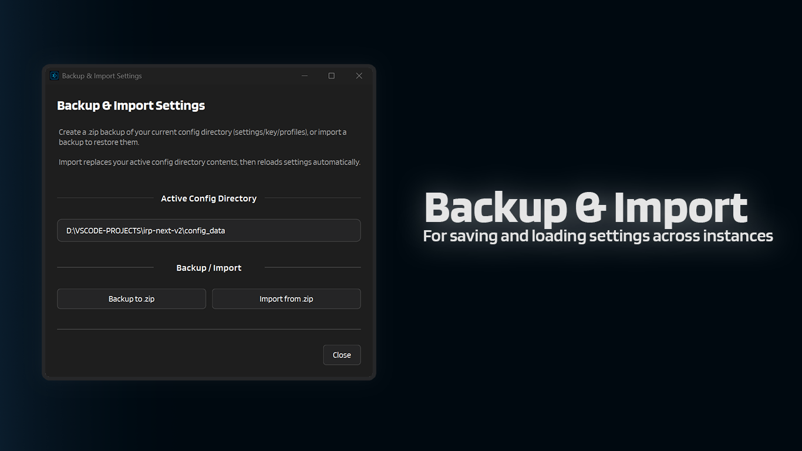

# :material-backup-restore: Backup & Import Settings

This window is for making a quick `.zip` backup of your current IntenseRP Next v2 config directory, or restoring one later.

---

## :material-cursor-default-click: How to open it

1. Open **Help & Extras**
2. Click **Backup / Import Settings**

---

## :material-folder: What gets backed up

The backup is made from your **active config directory** (shown at the top of the window). This usually contains things like:

- `settings.json.enc` (your encrypted settings)
- `settings.key` (the encryption key for your settings)
- `playwright_profiles/` (used for Persistent Sessions)

!!! note "Tip: stop services for a cleaner backup"
    If the browser/services are running, some profile files can be in use. For the most complete backup, click **Stop** in the main window first.

---

## :material-archive-arrow-up: Backup to .zip

1. Click **Backup to .zip**
2. Choose where to save the file
3. Done

By default, the file name looks like:

`intenserp-next-config-backup-YYYYMMDD-HHMMSS.zip`

If some files are locked, the backup can still succeed, but it may warn that it skipped files.

---

## :material-archive-arrow-down: Import from .zip

Import restores a backup by **replacing the contents** of your active config directory, and then reloading settings automatically.

1. Click **Import from .zip**
2. Select a backup `.zip`
3. Confirm the warning
4. Wait for the import to finish

!!! warning "Profiles can be locked"
    If **Persistent Sessions** are enabled and the browser/services are running, import can fail because profile files are in use. Stop services first and retry.

---

## :material-arrow-left: Back

[:material-arrow-left: Util Reference](../util-reference.md)

