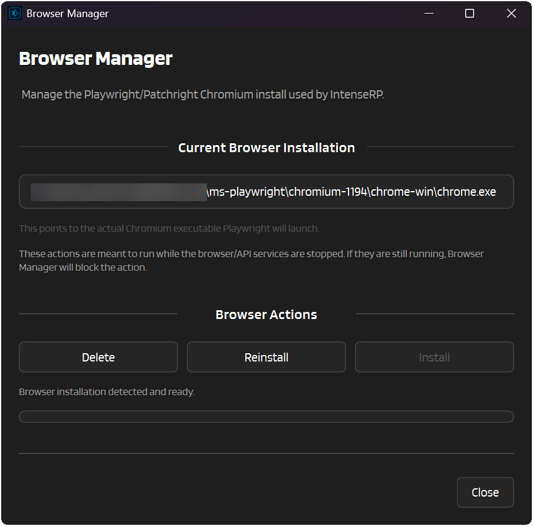

# :material-web: Browser Manager

The **Browser Manager** window will deal with the Playwright-managed Chromium browser for you.

It shows the current Chromium executable path IntenseRP will use, and gives you quick controls to install, reinstall it cleanly, or remove it entirely.

!!! warning "Stop services first"
    If the API/browser services are already running, Browser Manager will block changes and ask you to stop everything from the main window first.

---

## :material-help-circle: Why not just install once and forget about it?

Recently an issue has come up where a WAF (Web Application Firewall) on some providers (GLM and Qwen so far) blocks the installed Playwright browser from using them (perhaps due to it being outdated, or just a weird quirk of the WAF). The resolution to that issue was to reinstall the browser, which made it work again. The Browser Manager essentially gives you the tools to do exactly that, without needing to mess with command lines or hidden folders.

## :material-cursor-default-click: How to open it

From the main window:

1. Click **Tools**
2. Click **Browser Manager**

---

## :material-file-cabinet: What it shows

At the top, you get the current browser executable path. If Chromium is already installed, that path points directly to the Playwright/Patchright executable IntenseRP launches. If nothing is installed yet, the window tells you that too.

---

## :material-playlist-edit: Actions

### Install

Appears when no browser installation is currently detected.

Browser Manager installs the Chromium bundle IntenseRP needs, then refreshes the status/path right away.

### Reinstall

Removes the current browser installation, downloads a fresh one, then refreshes the path.

This is handy when the browser install got corrupted, half-updated, or outdated.

### Delete

Removes the local Playwright browser installation used by IntenseRP.

You can always come back later and click **Install** again.

---

## :material-arrow-left: Back

[:material-arrow-left: Util Reference](../util-reference.md)
