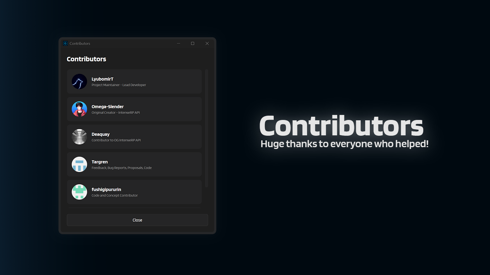

# :material-account-group: Contributors

This window shows a scrollable list of project contributors.

---

## :material-cursor-default-click: How to open it

1. Open **Help & Extras**
2. Click **Contributors**

---

## :material-open-in-new: Links and avatars

- Clicking a contributor card opens their profile link in your browser.
- Avatars may take a moment to load (and may not load at all if you have no internet access).

---

## :material-arrow-left: Back

[:material-arrow-left: Util Reference](../util-reference.md)

