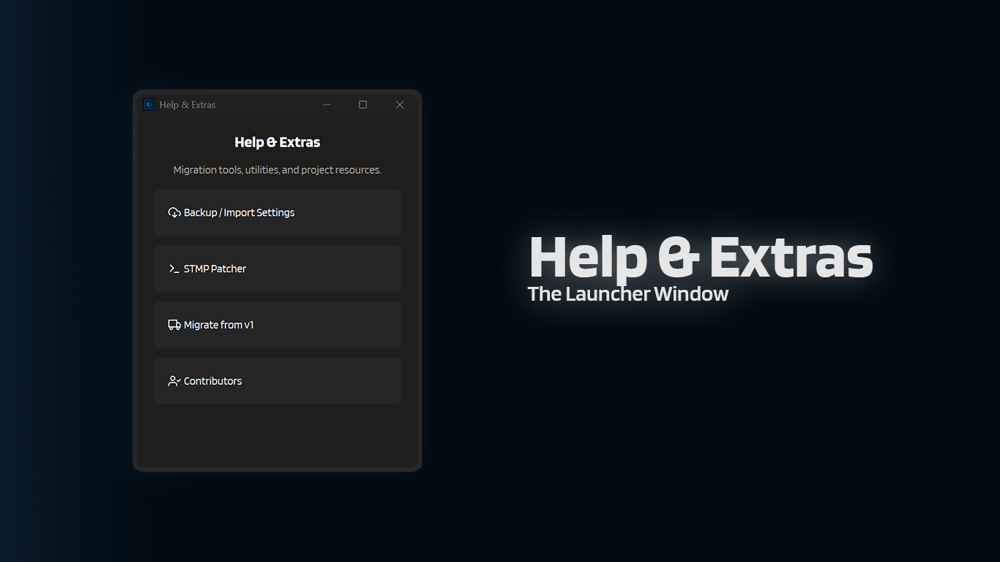

# :material-help-box: Help & Extras

The **Help & Extras** window is a small launcher for utilities and project resources.

---

## :material-cursor-default-click: How to open it

From the main window:

1. Click **Help**
2. The **Help & Extras** window opens

---

## :material-view-grid: What's inside

### :material-backup-restore: Backup / Import Settings

Back up your active config directory to a `.zip`, or restore one.

:material-arrow-right: [Backup & Import Settings](backup-import-settings.md)

### :material-web: Browser Manager

Shows the current Playwright/Patchright Chromium executable path and lets you **Install**, **Reinstall**, or **Delete** the browser bundle IntenseRP uses.

If the API/browser services are still running, it will stop you and ask you to shut everything down first.

:material-arrow-right: [Browser Manager](browser-manager.md)

### :material-puzzle-edit-outline: STMP Patcher

Patches **RossAscends's STMP** so it includes per-message names, which makes name detection in IntenseRP much more reliable.

:material-arrow-right: [STMP Patcher](stmp-patcher.md)

### :material-transfer: Migrate from v1

Imports settings from **IntenseRP Next v1.5.3+** by reading `save/config.enc` + `save/secret.key` from your old install folder.

This is a guided flow (it will ask you to pick your v1 folder), but you should still manually review your settings after.

:material-arrow-right: [Migration Guide](../migration.md)

### :material-account-group: Contributors

Shows a scrollable list of contributors. Clicking a card opens their profile.

:material-arrow-right: [Contributors](contributors.md)

### :material-chat: Discord Server

Opens the IntenseRP Next Discord server for quick questions, shared troubleshooting, and casual feedback.

:material-arrow-right: [Join Discord](https://discord.gg/ZWYNnXt7)

### :material-email: Contact & Support

Opens the contact page with GitHub, Discord, Telegram, and email options.

:material-arrow-right: [Means of Contact](../hands/contact.md)

### :material-heart: Donate

Opens the optional financial support section in the docs.

:material-arrow-right: [Support the Project](../hands/support.md#financial-support-optional)

---

## :material-arrow-left: Back

[:material-arrow-left: Util Reference](../util-reference.md)
