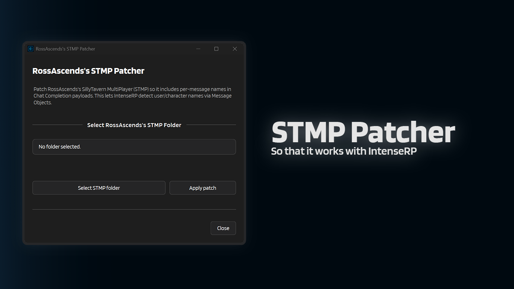

# :material-puzzle-edit-outline: STMP Patcher

This window patches **RossAscends's SillyTavern MultiPlayer (STMP)** so it includes per-message names in Chat Completion payloads.

That makes IntenseRP much better at detecting the real user/character names when you're using STMP.

---

## :material-cursor-default-click: How to open it

1. Open **Help & Extras**
2. Click **STMP Patcher**

---

## :material-folder-search: Selecting the STMP folder

Click **Select STMP folder** and pick your RossAscends STMP root folder.

The patcher checks for:

- `server.js` (to confirm it's an STMP folder)
- `src/api-calls.js` (the file it patches)

After selecting a folder, you'll see a status like:

- **Status: already patched** (the button is disabled)
- **Status: not patched** (you can apply the patch)

---

## :material-auto-fix: Applying the patch

1. Click **Apply patch**
2. Confirm the warning (it will modify a file)
3. When it finishes, restart STMP

The patcher creates a backup copy next to `src/api-calls.js` before writing changes (example: `api-calls.js.irpnext.bak`).

!!! tip "Already using the Feature docs?"
    For the "why", plus the IntenseRP settings you need for name detection, see:

    :material-arrow-right: [Features - STMP Support](../features/stmp-support.md)

---

## :material-arrow-left: Back

[:material-arrow-left: Util Reference](../util-reference.md)
